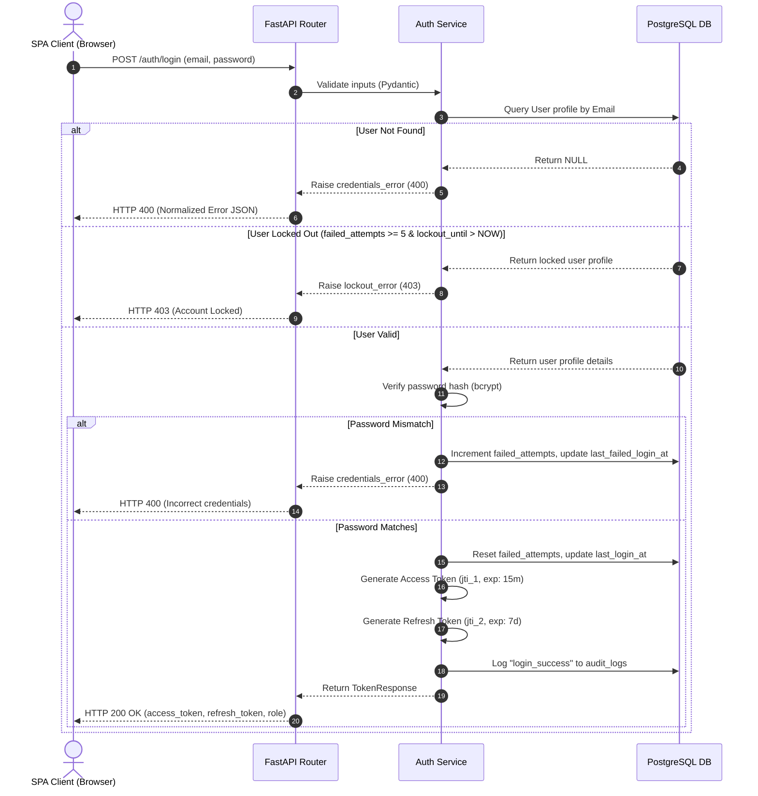

# Authentication Security Architecture Report

## Project: SafeRoute AI
### AI-Powered Road Accident Hotspot Prediction System

---

| Metric | Details |
| :--- | :--- |
| **Document Version** | 1.0.0 |
| **Status** | Frozen |
| **Author** | SafeRoute AI Security Review Board |
| **Date** | 2026-07-27 |
| **Intended Audience** | Lead Developers, Security Reviewers, System Auditors |

---

## Table of Contents
1. [Executive Summary](#1-executive-summary)
2. [Authentication Flow Diagram](#2-authentication-flow-diagram)
3. [JWT Lifecycle & Token Specifications](#3-jwt-lifecycle--token-specifications)
4. [Refresh Token Rotation (RTR) Strategy](#4-refresh-token-rotation-rtr-strategy)
5. [Token Blacklisting (JTI Tracking) Strategy](#5-token-blacklisting-jti-tracking-strategy)
6. [Password Strength Policy & Lockout Parameters](#6-password-strength-policy--lockout-parameters)
7. [API Security Checklist & HTTP Headers](#7-api-security-checklist--http-headers)
8. [Threat Modeling Analysis](#8-threat-modeling-analysis)
9. [Future Planned Security Enhancements (Post-MVP)](#9-future-planned-security-enhancements-post-mvp)
10. [Revision History](#10-revision-history)
11. [References](#11-references)

---

## 1. Executive Summary
This report defines the authentication security architecture deployed in **Phase 2** of the SafeRoute AI application. It provides specifications for our JSON Web Token (JWT) lifecycle, Refresh Token Rotation (RTR) mechanics, database-backed `jti` blacklist audits, strict password policy validators, brute-force lockout safeguards, and secure HTTP transport headers.

---

## 2. Authentication Flow Diagram

The sequence diagram below displays the user authentication flow:

---

## 3. JWT Lifecycle & Token Specifications
The authentication pipeline implements stateless signed JSON Web Tokens (JWT) signed via HMAC-SHA256 (`HS256`).

* **Access Token**:
  * **Lifetime**: 15 minutes.
  * **Payload Claims**: `sub` (User ID), `email`, `role`, `token_type` ("access"), `jti` (JWT ID), `exp`.
  * **Client Storage**: React memory state (Context state).
* **Refresh Token**:
  * **Lifetime**: 7 days.
  * **Payload Claims**: `sub` (User ID), `email`, `role`, `token_type` ("refresh"), `jti` (JWT ID), `exp`.
  * **Client Storage**: Session/Local Storage (MVP fallback; see Section 9 for HttpOnly roadmap).

---

## 4. Refresh Token Rotation (RTR) Strategy
To mitigate the risk of refresh token theft, the refresh endpoint enforces **token rotation**:
1. When a user requests a token refresh (`POST /auth/refresh`), they submit their current `refresh_token`.
2. The server decodes the token, extracts the unique `jti`, and verifies that it is not blacklisted.
3. The server immediately blacklists the old refresh token's `jti`, preventing its reuse.
4. The server generates a new access token and a new refresh token, returning both in the response payload.
5. If a client attempts to reuse an old refresh token, the blacklist check fails, and the request is rejected with a `401 Unauthorized` status.

---

## 5. Token Blacklisting (JTI Tracking) Strategy
To enforce explicit logouts and prevent token reuse, we track revoked tokens in an `invalidated_tokens` table:

* **Table Structure**:
  * `id` (UUID Primary Key)
  * `jti` (Unique JWT ID string index)
  * `user_id` (Foreign Key referencing `users`)
  * `token_type` (access or refresh)
  * `expires_at` (Expiration timestamp)
  * `invalidated_at` (Timestamp when token was blacklisted)
* **Verify Logic**:
  The authentication middleware queries the `invalidated_tokens` table for the token's `jti` claim. If a match is found, the request is rejected immediately, even if the token's expiration time is still valid.

---

## 6. Password Strength Policy & Lockout Parameters

### 6.1 Password Strength Requirements
Form fields on both the frontend and backend validate that passwords meet the following strength criteria:
* Minimum length of **8 characters**.
* Contains at least one **uppercase letter** (`A-Z`).
* Contains at least one **lowercase letter** (`a-z`).
* Contains at least one **digit** (`0-9`).
* Contains at least one **special character** (`!@#$%^&*()`).

### 6.2 Brute-Force Lockout Policy
* **Threshold**: Locked after **5 consecutive failed login attempts**.
* **Lockout Duration**: Configurable, set to **15 minutes**.
* **Database Tracking**: Columns inside `users` table monitor `failed_login_attempts`, `lockout_until`, `last_login_at`, and `last_failed_login_at` values.

---

## 7. API Security Checklist & HTTP Headers
Nginx and FastAPI middleware enforce the following security controls:

* **Strict HTTPS**: Enforced with HSTS headers:
  `Strict-Transport-Security: max-age=31536000; includeSubDomains`
* **Clickjacking Protection**: Deny rendering inside frames:
  `X-Frame-Options: DENY`
* **MIME Sniffing Prevention**: Force browser content-type mapping validation:
  `X-Content-Type-Options: nosniff`
* **Content Security Policy (CSP)**: Restrict scripts loading to trusted domains:
  `Content-Security-Policy: default-src 'self'; frame-ancestors 'none';`

---

## 8. Threat Modeling Analysis
* **Threat: Credential Stuffing**: Attackers perform rapid login attempts using compromised credentials.
  * *Mitigation*: IP-based rate limiting on `/auth/login` (maximum 5 requests per minute) and brute-force account lockouts.
* **Threat: Replay Attacks**: Intercepted tokens are reused to gain unauthorized access.
  * *Mitigation*: Transport encryption (HTTPS/TLS 1.3) protects tokens in transit, and short-lived access tokens (15 minutes) reduce the window of vulnerability.

---

## 9. Future Planned Security Enhancements (Post-MVP)
* **HttpOnly Cookies**: Transition token storage from localStorage to HttpOnly, Secure, SameSite cookies to protect tokens from Cross-Site Scripting (XSS) vectors.
* **IP-based Session Anchoring**: Verify that the client IP address matches the IP address captured during the initial login step.

---

## 10. Revision History

| Version | Date | Author | Description |
| :--- | :--- | :--- | :--- |
| **1.0.0** | 2026-07-27 | Security Review Board | Initial authentication security architecture report finalized. |

---

## 11. References
1. *OWASP Authentication Decision Guide*: https://cheatsheetseries.owasp.org/cheatsheets/Authentication_Cheat_Sheet.html
2. *OAuth 2.0 Security Best Current Practices (RTR)*: https://datatracker.ietf.org/doc/html/draft-ietf-oauth-security-topics
3. *Bcrypt Hashing Recommendations*: https://cheatsheetseries.owasp.org/cheatsheets/Password_Storage_Cheat_Sheet.html
