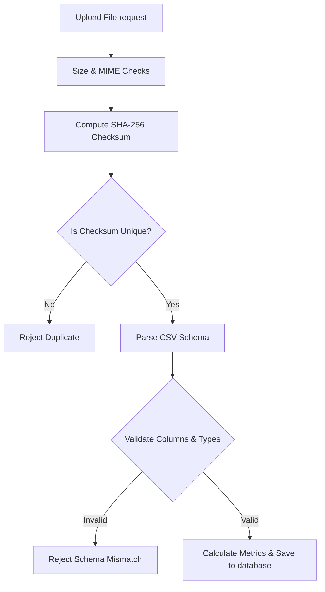

# SafeRoute AI Dataset Management Report

---

| Metric | Details |
| :--- | :--- |
| **Document Version** | 1.0.0 |
| **Status** | Completed |
| **Author** | Lead Data Engineer |
| **Date** | 2026-07-28 |

---

## 1. Executive Summary
This report describes the dataset upload, validation, and metadata tracking systems implemented in Phase 5 of SafeRoute AI.

---

## 2. Dataset Upload & Verification Workflow

---

## 3. Data Integrity & Validation Rules

* **Size Limitations**: Limits uploads to 50MB.
* **Format Checks**: Restricts uploads to valid CSV files (`text/csv`).
* **Schema Verification**: Confirms that required features are present:
  * `weather`
  * `traffic_density`
  * `road_type`
  * `average_speed`
  * `time_of_day`
  * `accident`
* **Categorical Value Constraints**: Rejects invalid values for categorical variables (e.g. values other than `Morning`, `Afternoon`, `Evening`, `Night` for `time_of_day`).
* **Integrity Protection**: Calculates a SHA-256 hash of the file contents. Rejects files with duplicate hashes to prevent redundant uploads.
* **Storage Location**: Saves files outside the web root (`backend/uploads/`) with sanitized filenames to prevent directory traversal attacks.
