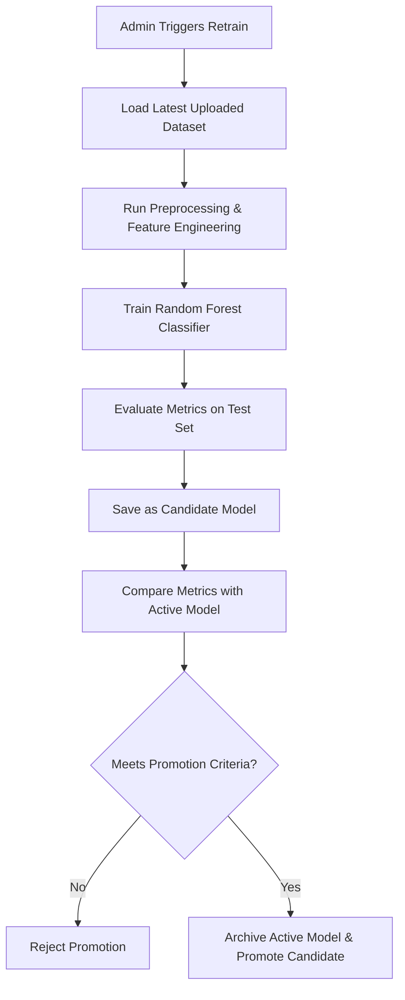

# SafeRoute AI Model Retraining Pipeline Report

---

| Metric | Details |
| :--- | :--- |
| **Document Version** | 1.0.0 |
| **Status** | Completed |
| **Author** | Lead Machine Learning Architect |
| **Date** | 2026-07-28 |

---

## 1. Executive Summary
This report describes the automated model retraining, evaluation, and promotion pipeline implemented to support model updates for the SafeRoute AI MVP.

---

## 2. Pipeline Retraining Workflow

---

## 3. Candidate Generation vs. Promotion Controls

* **Candidate Model Isolation**: Trained models are saved as candidates (e.g. `candidate_model_vX.joblib`) to prevent overwriting the active model during training.
* **Latency SLA**: The candidate's inference latency must remain under **200ms** to satisfy the SLA.
* **F1-Score Comparison**: The candidate must outperform the active model's F1-Score to be promoted.
* **Archiving & Rollback**: When a candidate is promoted, the previous model is archived in the `ml/archive/` folder, allowing for manual rollbacks if needed.
* **Comparison Report**: Generates `MODEL_COMPARISON_REPORT.md` to document metrics changes for audit reviews.
