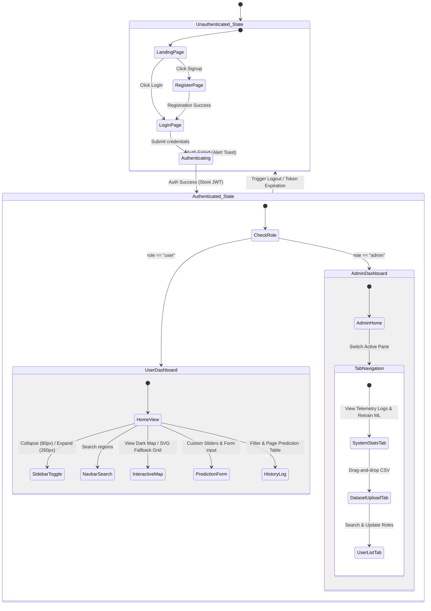
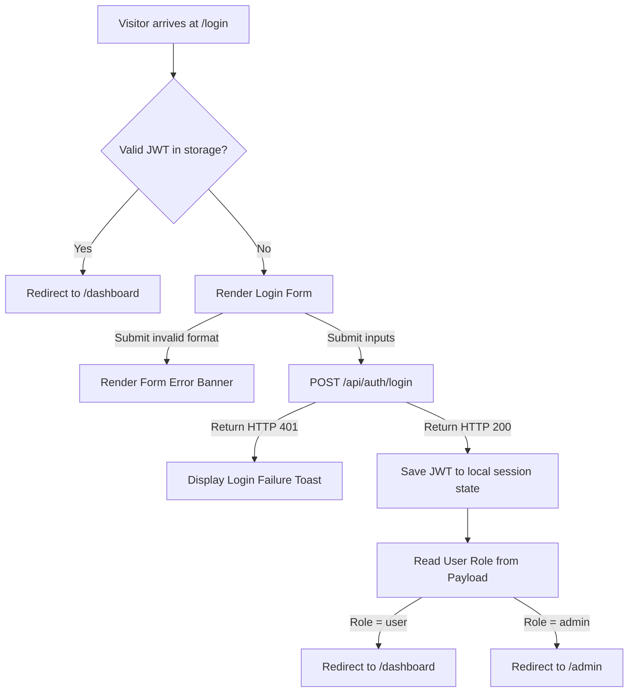
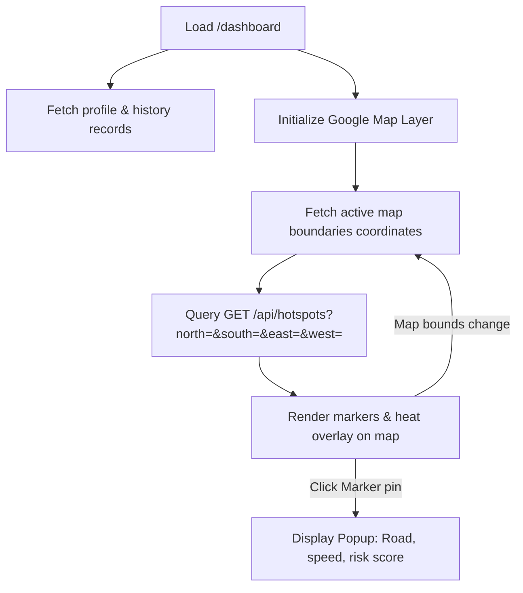
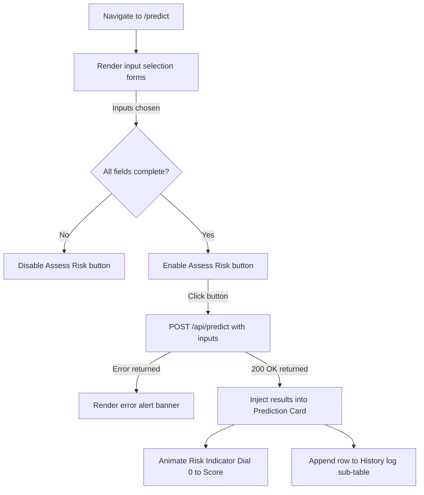

# Application Navigation & User Flows

## Project: SafeRoute AI
### AI-Powered Road Accident Hotspot Prediction System

---

| Metric | Details |
| :--- | :--- |
| **Document Version** | 1.0.0 |
| **Status** | Approved |
| **Author** | SafeRoute AI UI/UX Design & Architecture Team |
| **Date** | 2026-07-27 |
| **Intended Audience** | Frontend Developers, QA Engineers, UI Designers |

---

## Table of Contents
1. [Introduction & Purpose](#1-introduction--purpose)
2. [Global Application State Machine](#2-global-application-state-machine)
3. [User Flow: Authentication & Registration](#3-user-flow-authentication--registration)
4. [User Flow: Main Dashboard & Map Interaction](#4-user-flow-main-dashboard--map-interaction)
5. [User Flow: AI Risk Prediction Form](#5-user-flow-ai-risk-prediction-form)
6. [User Flow: Admin Administration](#6-user-flow-admin-administration)
7. [User Flow: System Logouts & Session Expirations](#7-user-flow-system-logouts--session-expirations)
8. [User Flow: Exception Handling & Network Interrupts](#8-user-flow-exception-handling--network-interrupts)
9. [Assumptions, Risks & Mitigation](#9-assumptions-risks--mitigation)
10. [Best Practices](#10-best-practices)
11. [Future Application Flows](#11-future-application-flows)
12. [Revision History](#12-revision-history)
13. [References](#13-references)

---

## 1. Introduction & Purpose
This document maps user journeys, navigation matrices, and client-side view states for SafeRoute AI. Developers and QA engineers should reference this file to understand routing transitions, screen layout logic, role restrictions, and application response states.

---

## 2. Global Application State Machine
The core layout routes user requests based on authentication status and user roles.

---

## 3. User Flow: Authentication & Registration

### 3.1 Registration Workflow
1. User navigates to `/register`.
2. Component displays registration fields: Full Name, Email, Password, and Password Confirmation.
3. Form checks inputs locally (validating email matches standard regex patterns and password is at least 8 characters).
4. Submits payload to backend using `POST /api/auth/register`.
5. If success, displays green success notification banner and redirects user to `/login` within 1.5 seconds.

---

## 4. User Flow: Main Dashboard & Map Interaction
Upon successful login, user role redirection resolves the view to the primary dashboard.

### 4.2 Chart Panel Interactions
* Dashboard panels retrieve previous query logs.
* Visual charts (using Chart.js) compute user trends (e.g., number of high risk queries vs low risk queries).
* Hovering over dynamic bars reveals specific details (total count of queries).

---

## 5. User Flow: AI Risk Prediction Form
Allows commuters to simulate accident probabilities for custom driving settings.

---

## 6. User Flow: Admin Administration
Admin controls are partitioned from standard routing scopes.

### 6.1 Dataset Upload Actions
1. Admin clicks `/admin/dataset`.
2. System loads drag-and-drop file interface.
3. File picker filters input files, accepting `.csv` formats only.
4. Admin drops file and clicks "Process Dataset".
5. SPA transmits file block using `POST /api/admin/dataset/upload` (Form Encoded).
6. Success returns banner status: "Dataset accepted. 4500 rows parsed".

---

## 7. User Flow: System Logouts & Session Expirations

### 7.1 Explicit User Logout
1. User clicks the "Logout" option in header dropdown profiles.
2. System clears stored JWT tokens and user properties from localStorage.
3. Client redirects views immediately to `/login`.
4. System displays toast notification: "Logout successful. See you soon!"

### 7.2 Session Timeout Logic (24 Hour expiry)
* Client-side Axios interceptors check all response codes.
* If backend API returns `401 Unauthorized` with sub-code identifier "TOKEN_EXPIRED", application triggers the logout workflow automatically.
* Redirects user to `/login?session_expired=true` and displays red banner: "Session expired. Please log in again."

---

## 8. User Flow: Exception Handling & Network Interrupts

### 8.1 Network Connection Disconnects
* If backend servers become unreachable (causing Axios network errors), frontend displays a persistent status banner at top of view: "Offline: Unable to establish API connection. Attempting to reconnect..."
* Interactive buttons (like "Assess Risk") are set to disabled state.

---

## 9. Assumptions, Risks & Mitigation

### 9.1 Assumptions
* Renders remain clean on both mobile screens (375px wide) and desktop displays (1920px wide) without horizontal scroll overflows.

### 9.2 Risks & Mitigation
* **Risk**: Users navigating using browser "Back" buttons after logging out returning to cached views.
  * *Mitigation*: Enable standard Cache-Control headers on frontend assets, and run authentication validity checks inside React `useEffect` roots.

---

## 10. Best Practices
* **Provide Feedback**: Always show loading spinners or skeleton frames when querying APIs.
* **Keep Users Informed**: Present user-facing validation issues in clean forms rather than dumping raw JSON error objects.

## 11. Future Application Flows
* Introduce audio announcements for commuters alerting them as they drive near high-risk zones.

## 12. Revision History

| Version | Date | Author | Description |
| :--- | :--- | :--- | :--- |
| **1.0.0** | 2026-07-27 | UI/UX Lead | Complete mapping of user transitions, error redirect paths, and session expirations. |

---

## 13. References
1. *React Router Authentication Guidance*: https://reactrouter.com/en/main/start/overview
2. *W3C Navigation Design Patterns*: https://www.w3.org/WAI/patterns/
3. *Google Maps Markers Best Practices*: https://developers.google.com/maps/documentation/javascript/custom-markers
