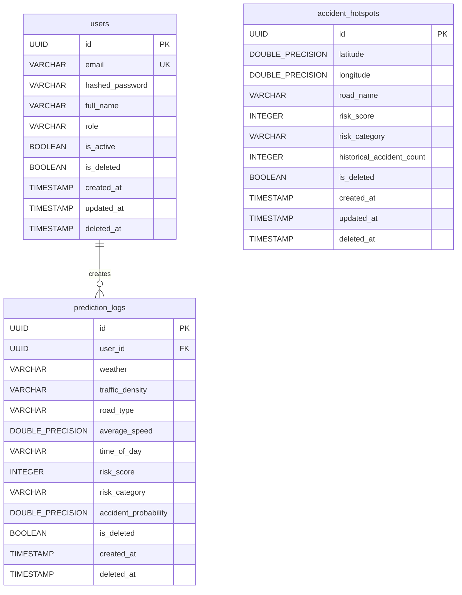

# Database Schema Design Document

## Project: SafeRoute AI
### AI-Powered Road Accident Hotspot Prediction System

---

| Metric | Details |
| :--- | :--- |
| **Document Version** | 1.0.0 |
| **Status** | Approved |
| **Author** | SafeRoute AI Database Engineer |
| **Date** | 2026-07-27 |
| **Intended Audience** | Backend Developers, DBA, QA, DevOps Engineers |

---

## Table of Contents
1. [Purpose & Database Selection](#1-purpose--database-selection)
2. [Entity Relationship Diagram (ERD)](#2-entity-relationship-diagram-erd)
3. [Table Specifications](#3-table-specifications)
4. [Indexing Strategy](#4-indexing-strategy)
5. [Soft Delete Strategy](#5-soft-delete-strategy)
6. [Migration Strategy (Alembic)](#6-migration-strategy-alembic)
7. [Backup & Recovery Strategy](#7-backup--recovery-strategy)
8. [Assumptions, Risks & Mitigation](#8-assumptions-risks--mitigation)
9. [Best Practices](#9-best-practices)
10. [Future Schema Extensions](#10-future-schema-extensions)
11. [Revision History](#11-revision-history)
12. [References](#12-references)

---

## 1. Purpose & Database Selection
This document details the schema definitions, relational constraints, auditing parameters, and migrations workflows for the SafeRoute AI database storage tier.
* **Database Choice**: PostgreSQL `16.x`
* **Rationale**: Strong ACID compliance, robust indexing capabilities (including geometry options for GIS extensions in future road tracking phases), high concurrency handle capacities, and native support inside Python SQLAlchemy frameworks.

---

## 2. Entity Relationship Diagram (ERD)

The entity relationships are structured as a 1-to-many topology tracking prediction executions against authenticated user keys.



---

## 3. Table Specifications

### 3.1 Table: `users`
Stores user profile information, authentication hashes, and roles.

| Column Name | Data Type | Nullability | Constraints | Default | Description |
| :--- | :--- | :--- | :--- | :--- | :--- |
| `id` | `UUID` | NOT NULL | PRIMARY KEY | `gen_random_uuid()` | Unique user identifier. |
| `email` | `VARCHAR(255)` | NOT NULL | UNIQUE | None | User email (used for login). |
| `hashed_password` | `VARCHAR(255)` | NOT NULL | None | None | Bcrypt hashed password. |
| `full_name` | `VARCHAR(100)` | NOT NULL | None | None | User's full name. |
| `role` | `VARCHAR(20)` | NOT NULL | Check (`role` IN ('user', 'admin')) | `'user'` | Role-based authorization tier. |
| `is_active` | `BOOLEAN` | NOT NULL | None | `TRUE` | Controls whether user is active. |
| `is_deleted` | `BOOLEAN` | NOT NULL | None | `FALSE` | Flag for soft deletion. |
| `created_at` | `TIMESTAMP` | NOT NULL | None | `CURRENT_TIMESTAMP` | Log record creation time. |
| `updated_at` | `TIMESTAMP` | NOT NULL | None | `CURRENT_TIMESTAMP` | Log record modification time. |
| `deleted_at` | `TIMESTAMP` | NULL | None | NULL | Timestamp of soft delete action. |

---

### 3.2 Table: `prediction_logs`
Records every manual prediction execution submitted through the dashboard.

| Column Name | Data Type | Nullability | Constraints | Default | Description |
| :--- | :--- | :--- | :--- | :--- | :--- |
| `id` | `UUID` | NOT NULL | PRIMARY KEY | `gen_random_uuid()` | Unique log identifier. |
| `user_id` | `UUID` | NOT NULL | FOREIGN KEY references `users(id)` | None | The user who requested prediction. |
| `weather` | `VARCHAR(50)` | NOT NULL | None | None | Input weather condition. |
| `traffic_density` | `VARCHAR(50)` | NOT NULL | None | None | Input traffic density score. |
| `road_type` | `VARCHAR(50)` | NOT NULL | None | None | Input road classification. |
| `average_speed` | `DOUBLE PRECISION`| NOT NULL | Check (`average_speed` >= 0) | None | Average speed on road segment. |
| `time_of_day` | `VARCHAR(50)` | NOT NULL | None | None | Input time block of query. |
| `risk_score` | `INTEGER` | NOT NULL | Check (`risk_score` BETWEEN 0 AND 100)| None | Returned model risk score. |
| `risk_category` | `VARCHAR(20)` | NOT NULL | None | None | Risk tier (Low/Medium/High/Critical).|
| `accident_probability`|`DOUBLE PRECISION`| NOT NULL | None | None | Exact model prediction probability. |
| `is_deleted` | `BOOLEAN` | NOT NULL | None | `FALSE` | Soft delete flag. |
| `created_at` | `TIMESTAMP` | NOT NULL | None | `CURRENT_TIMESTAMP` | Date and time of query execution. |
| `deleted_at` | `TIMESTAMP` | NULL | None | NULL | Timestamp of soft delete action. |

---

### 3.3 Table: `accident_hotspots`
Contains coordinates and risk ratings for known hazardous locations visualised as overlays on the maps layout.

| Column Name | Data Type | Nullability | Constraints | Default | Description |
| :--- | :--- | :--- | :--- | :--- | :--- |
| `id` | `UUID` | NOT NULL | PRIMARY KEY | `gen_random_uuid()` | Unique hotspot identifier. |
| `latitude` | `DOUBLE PRECISION`| NOT NULL | Check (`latitude` BETWEEN -90 AND 90) | None | GPS latitude coordinate. |
| `longitude` | `DOUBLE PRECISION`| NOT NULL | Check (`longitude` BETWEEN -180 AND 180)| None| GPS longitude coordinate. |
| `road_name` | `VARCHAR(255)` | NOT NULL | None | None | Road segment name. |
| `risk_score` | `INTEGER` | NOT NULL | Check (`risk_score` BETWEEN 0 AND 100)| None | Risk score evaluated on location. |
| `risk_category` | `VARCHAR(20)` | NOT NULL | None | None | Risk classification. |
| `historical_accident_count`|`INTEGER`| NOT NULL | Check (`historical_accident_count`>=0)| `0`| Historical incident records count. |
| `is_deleted` | `BOOLEAN` | NOT NULL | None | `FALSE` | Soft delete flag. |
| `created_at` | `TIMESTAMP` | NOT NULL | None | `CURRENT_TIMESTAMP` | Date records added. |
| `updated_at` | `TIMESTAMP` | NOT NULL | None | `CURRENT_TIMESTAMP` | Date records updated. |
| `deleted_at` | `TIMESTAMP` | NULL | None | NULL | Timestamp of soft delete action. |

---

## 4. Indexing Strategy

To speed up visualization overlays and user audit searches, dedicated database indexes are defined.

```sql
-- Index on email to support high-speed user login lookups
CREATE UNIQUE INDEX idx_users_email ON users(email) WHERE is_deleted = FALSE;

-- Index on prediction_logs foreign keys to speed up user history queries
CREATE INDEX idx_prediction_logs_user_id ON prediction_logs(user_id) WHERE is_deleted = FALSE;

-- Composite Index on hotspot locations to fast-search visible bounding box pins
CREATE INDEX idx_hotspots_lat_lng ON accident_hotspots(latitude, longitude) WHERE is_deleted = FALSE;
```

---

## 5. Soft Delete Strategy
To prevent accidental administrative data loss, hard deletions (`DELETE FROM`) are strictly blocked in system pipelines.
* **Fields**: `is_deleted` (Boolean flag) and `deleted_at` (nullable TIMESTAMP) are added to all models.
* **Implementation**: API read queries enforce filter clauses:
  `SELECT * FROM users WHERE email = :email AND is_deleted = FALSE;`
* **Clean-up**: An offline Cron task executes monthly to purge records marked as deleted for over 90 days (`DELETE FROM table WHERE is_deleted = TRUE AND deleted_at < NOW() - INTERVAL '90 days'`).

---

## 6. Migration Strategy (Alembic)
Database structures are managed using Alembic migration tools to guarantee consistency across local, staging, and production databases.
1. **Initiation**: Create migrations package using command: `alembic init alembic`.
2. **Configuration**: Edit `env.py` to import core SQLAlchemy Base metadata so alembic can auto-detect table modifications.
3. **Execution**:
   * Generate migration script: `alembic revision --autogenerate -m "create_initial_tables"`
   * Apply migration scripts: `alembic upgrade head`
   * Rollback migrations script (if needed): `alembic downgrade -1`

---

## 7. Backup & Recovery Strategy
* **Frequency**: Full database physical backup performed daily at 02:00 UTC using `pg_dump`.
* **Storage**: Dump files are encrypted (AES-256) and synced automatically to secure AWS S3 bucket storage.
* **Retention Policy**: Keep daily backups for 7 days, weekly backups for 4 weeks, and monthly backups for 12 months.
* **Disaster Recovery (RTO / RPO)**:
  * **Recovery Time Objective (RTO)**: Restore database service within 2 hours of a fatal server crash.
  * **Recovery Point Objective (RPO)**: Maximum data loss window limited to 24 hours of logs.

---

## 8. Assumptions, Risks & Mitigation

### 8.1 Assumptions
* PostgreSql timezone configuration is pinned to UTC.
* SQLAlchemy ORM model names are mapped exactly in lowercase plural strings.

### 8.2 Risks & Mitigation
* **Risk**: Excessive reads on `accident_hotspots` causing database thread blockages when rendering heatmaps for thousands of concurrent screen views.
  * *Mitigation*: Enable PostgreSQL query result caching or query database only when map bounding-box boundary values change.

---

## 9. Best Practices
* **Parameterized Queries**: Never write concatenated strings in ORM queries. Always use SQLAlchemy's select API parameters to eliminate SQL injection vectors.
* **Audit Footprints**: Every table must contain `created_at` and `updated_at` columns, and timestamps must be auto-applied using DB engine defaults.

## 10. Future Schema Extensions
* **PostGIS Integration**: Transition latitude/longitude fields into database geometry spatial features (`GEOMETRY(Point, 4326)`) to execute efficient polygon search computations.
* **Alert Subscription Tables**: Create subscription mappings to trigger email/push alerts when risk markers near a user's home coordinate shift categories.

## 11. Revision History

| Version | Date | Author | Description |
| :--- | :--- | :--- | :--- |
| **1.0.0** | 2026-07-27 | Database Engineer | Initial database design including tables, audit columns, Alembic workflow, and indexes. |

---

## 12. References
1. *PostgreSQL 16 Indexing Guide*: https://www.postgresql.org/docs/16/indexes.html
2. *Alembic Auto-generation Docs*: https://alembic.sqlalchemy.org/en/latest/autogenerate.html
3. *SQLAlchemy ORM Model Mapping*: https://docs.sqlalchemy.org/en/20/orm/quickstart.html
