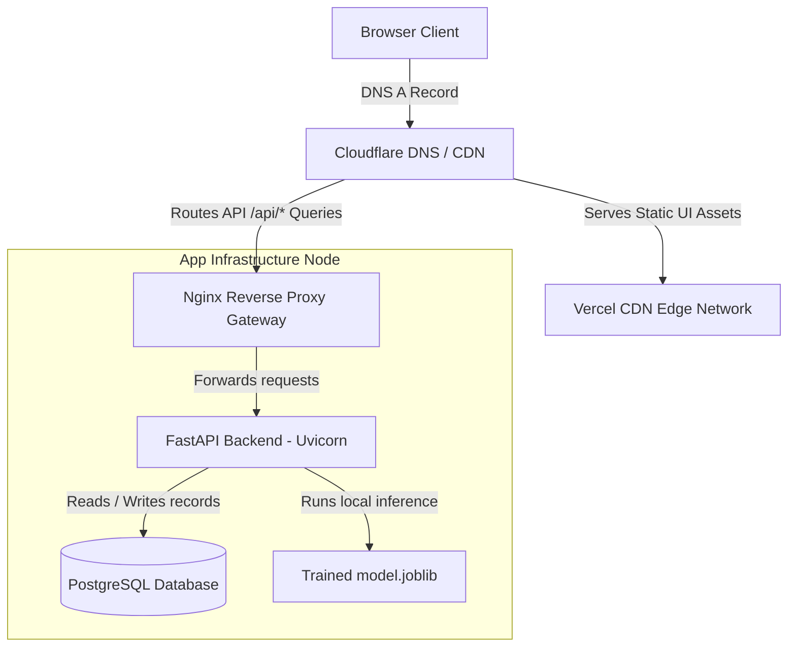

# Production Deployment & Infrastructure Guide

## Project: SafeRoute AI
### AI-Powered Road Accident Hotspot Prediction System

---

| Metric | Details |
| :--- | :--- |
| **Document Version** | 1.0.0 |
| **Status** | Approved |
| **Author** | SafeRoute AI Lead DevOps & Cloud Architect |
| **Date** | 2026-07-27 |
| **Intended Audience** | DevOps Engineers, Infrastructure Teams, System Operators |

---

## Table of Contents
1. [Production Architecture Topology](#1-production-architecture-topology)
2. [Containerization Configurations (Docker & Compose)](#2-containerization-configurations-docker--compose)
3. [Nginx Gateway & SSL Setup](#3-nginx-gateway--ssl-setup)
4. [CI/CD Deployment Pipelines (GitHub Actions)](#4-cicd-deployment-pipelines-github-actions)
5. [Cloud Platform Provisioning (Vercel & Render/Railway)](#5-cloud-platform-provisioning-vercel--renderrailway)
6. [Monitoring, Alerting & Log Management](#6-monitoring-alerting--log-management)
7. [Backup, Disaster Recovery & Restore Procedures](#7-backup-disaster-recovery--restore-procedures)
8. [Rollback Strategies](#8-rollback-strategies)
9. [Assumptions, Risks & Mitigation](#9-assumptions-risks--mitigation)
10. [Best Practices](#10-best-practices)
11. [Revision History](#11-revision-history)
12. [References](#12-references)

---

## 1. Production Architecture Topology

The production setup decouples static assets from dynamic ML calculations to achieve high availability.



---

## 2. Containerization Configurations (Docker & Compose)

We use multi-stage Docker builds to produce lightweight, secure production containers.

### 2.1 Backend Dockerfile (`backend/Dockerfile`)
```dockerfile
# Stage 1: Build Dependencies
FROM python:3.11-slim AS builder

WORKDIR /app

RUN apt-get update && apt-get install -y --no-install-recommends \
    build-essential \
    libpq-dev \
    && rm -rf /var/lib/apt/lists/*

COPY requirements.txt .
RUN pip install --no-cache-dir --user -r requirements.txt

# Stage 2: Production Runtime
FROM python:3.11-slim AS runner

WORKDIR /app

RUN apt-get update && apt-get install -y --no-install-recommends \
    libpq5 \
    && rm -rf /var/lib/apt/lists/*

COPY --from=builder /root/.local /root/.local
COPY . .

ENV PATH=/root/.local/bin:$PATH
ENV PYTHONUNBUFFERED=1

EXPOSE 8000

CMD ["uvicorn", "main:app", "--host", "0.0.0.0", "--port", "8000"]
```

---

### 2.2 Docker Compose Configuration (`docker-compose.yml`)
Used for self-hosted instances on Railway or dedicated VPS servers.

```yaml
version: '3.8'

services:
  nginx:
    image: nginx:1.25-alpine
    ports:
      - "80:80"
      - "443:443"
    volumes:
      - ./nginx/conf.d:/etc/nginx/conf.d
      - ./nginx/certs:/etc/nginx/certs
    depends_on:
      - backend
    restart: always

  backend:
    build:
      context: ./backend
      dockerfile: Dockerfile
    environment:
      - DATABASE_URL=postgresql://saferoute_user:${DB_PASSWORD}@db:5432/saferoute_db
      - JWT_SECRET_KEY=${JWT_SECRET}
    depends_on:
      - db
    restart: always

  db:
    image: postgres:16-alpine
    environment:
      - POSTGRES_USER=saferoute_user
      - POSTGRES_PASSWORD=${DB_PASSWORD}
      - POSTGRES_DB=saferoute_db
    volumes:
      - postgres_data:/var/lib/postgresql/data
    restart: always

volumes:
  postgres_data:
```

---

## 3. Nginx Gateway & SSL Setup

### 3.1 Nginx Site Configuration (`nginx/conf.d/default.conf`)
```nginx
server {
    listen 80;
    server_name api.saferouteai.com;
    return 301 https://$host$request_uri;
}

server {
    listen 443 ssl http2;
    server_name api.saferouteai.com;

    ssl_certificate /etc/nginx/certs/fullchain.pem;
    ssl_certificate_key /etc/nginx/certs/privkey.pem;
    ssl_protocols TLSv1.2 TLSv1.3;
    ssl_ciphers HIGH:!aNULL:!MD5;

    # Security Headers
    add_header X-Frame-Options "DENY" always;
    add_header X-Content-Type-Options "nosniff" always;
    add_header X-XSS-Protection "1; mode=block" always;
    add_header Content-Security-Policy "default-src 'self'; script-src 'self' 'unsafe-inline' https://maps.googleapis.com; style-src 'self' 'unsafe-inline' https://fonts.googleapis.com; img-src 'self' data: https://maps.gstatic.com https://*.googleapis.com;" always;

    location / {
        proxy_pass http://backend:8000;
        proxy_set_header Host $host;
        proxy_set_header X-Real-IP $remote_addr;
        proxy_set_header X-Forwarded-For $proxy_add_x_forwarded_for;
        proxy_set_header X-Forwarded-Proto $scheme;
    }
}
```

### 3.2 SSL Generation (Let's Encrypt & Certbot)
To provision certificates on virtual machine deployments:
```bash
sudo apt update
sudo apt install certbot python3-certbot-nginx -y
sudo certbot --nginx -d api.saferouteai.com
```
Certbot configures a cron job automatically to renew certificates before they expire.

---

## 4. CI/CD Deployment Pipelines (GitHub Actions)

### 4.1 Backend Pipeline Configuration (`.github/workflows/backend-deploy.yml`)
```yaml
name: Backend CI/CD Pipeline

on:
  push:
    branches: [ main ]
    paths:
      - 'backend/**'

jobs:
  test-and-lint:
    runs-on: ubuntu-latest
    steps:
      - uses: actions/checkout@v4
      - name: Set up Python
        uses: actions/setup-python@v5
        with:
          python-version: '3.11'
      - name: Install dependencies
        run: |
          cd backend
          pip install -r requirements.txt
          pip install flake8 pytest pytest-cov
      - name: Run lint
        run: |
          cd backend
          flake8 . --count --select=E9,F63,F7,F82 --show-source --statistics
      - name: Run unit tests
        run: |
          cd backend
          pytest --cov=app tests/

  deploy-to-render:
    needs: test-and-lint
    runs-on: ubuntu-latest
    steps:
      - name: Trigger Render Deploy Hook
        run: |
          curl -X POST "${{ secrets.RENDER_DEPLOY_HOOK_URL }}"
```

---

## 5. Cloud Platform Provisioning (Vercel & Render/Railway)

### 5.1 Frontend Deployment on Vercel
1. Log in to Vercel Console: https://vercel.com/.
2. Click **Add New Project** and link your GitHub repository.
3. Configure target directory: Select `frontend` root.
4. Set Build Settings:
   * Build Command: `npm run build` (runs Vite compiler, performing code tree-shaking, dynamic route splitting, and assets minification)
   * Output Directory: `dist`
5. Configure Environment Variables:
   * Add `VITE_API_BASE_URL` (points to Nginx gateway or Render backend endpoint).
   * Add `VITE_GOOGLE_MAPS_API_KEY` (must be restricted to the Vercel hosting domain).
6. Performance Optimizations:
   * Ensure Vite outputs clean chunks under 300kB each.
   * Enable gzip compression on static asset routes.
7. Click **Deploy**. Vercel provisions global CDN routing and updates previews for pull requests.

### 5.2 Backend Deployment on Render
1. Log in to Render Console: https://render.com/.
2. Select **New** > **Web Service**.
3. Link your GitHub repository.
4. Configure Properties:
   * Runtime: `Docker`
   * Docker Path: `./backend/Dockerfile`
5. Add Environment Variables (see [ENVIRONMENT_VARIABLES.md](file:///C:/Users/rghos%20-%20Vivekananda%20Institute%20of%20Professional%20Studies/PROJECTS/SafeRoute%20AI/ENVIRONMENT_VARIABLES.md)).
6. Connect PostgreSQL database instance (Render SQL database).
7. Select **Create Web Service**.

---

## 6. Monitoring, Alerting & Log Management
* **Resource Monitoring**: Track Docker CPU and memory allocations using Render dashboards or Prometheus metrics. Set alert thresholds at 85% CPU capacity.
* **Log Rotation**: Configure Docker log parameters in `/etc/docker/daemon.json` to prevent disk storage overflow:
  ```json
  {
    "log-driver": "json-file",
    "log-opts": {
      "max-size": "10m",
      "max-file": "3"
    }
  }
  ```

---

## 7. Backup, Disaster Recovery & Restore Procedures

### 7.1 Database Backup Script (`scripts/backup_db.sh`)
```bash
#!/bin/bash
BACKUP_DIR="/var/backups/postgres"
DB_NAME="saferoute_db"
TIMESTAMP=$(date +%F_%H-%M-%S)
BACKUP_FILE="$BACKUP_DIR/$DB_NAME_$TIMESTAMP.sql.gz"

mkdir -p $BACKUP_DIR
pg_dump -U saferoute_user $DB_NAME | gzip > $BACKUP_FILE

# Sync to S3 using AWS CLI
aws s3 cp $BACKUP_FILE s3://saferoute-db-backups/
```

### 7.2 Database Restoration Execution
To restore database states using a backup file:
```bash
gunzip -c saferoute_db_2026-07-27.sql.gz | psql -U saferoute_user -d saferoute_db
```

---

## 8. Rollback Strategies

### 8.1 API Code & Model Rollback
If a deployment degrades system performance:
1. Revert to the last stable deployment on Vercel or Render using the console.
2. If database schema changes are present, run the Alembic downgrade command:
   ```bash
   alembic downgrade -1
   ```
3. Verify connection states and restart the FastAPI process.

---

## 9. Assumptions, Risks & Mitigation

### 9.1 Assumptions
* The target environment (AWS, Render, or Railway) has sufficient network capacity to route API calls during traffic spikes.

### 9.2 Infrastructure Risks & Mitigation
* **Risk**: Database connection limits are exceeded during peak usage.
  * *Mitigation*: Adjust PgBouncer configurations to pool connections, and configure application connection limits to 50 active threads.

---

## 10. Best Practices
* **Use Staging Environments**: Always deploy modifications to a staging environment before releasing changes to production servers.
* **Scan Container Images**: Run vulnerability scans on your Docker base images before deployments.

## 11. Revision History

| Version | Date | Author | Description |
| :--- | :--- | :--- | :--- |
| **1.0.0** | 2026-07-27 | Cloud Architect | Production deployment specifications finalized, including multi-stage Dockerfiles and CI/CD pipelines. |

---

## 12. References
1. *Docker Production Best Practices*: https://docs.docker.com/develop/develop-images/dockerfile_best-practices/
2. *Nginx SSL Configuration Guidelines*: https://ssl-config.mozilla.org/
3. *Vercel Deployment Environments*: https://vercel.com/docs/concepts/deployments/overview
