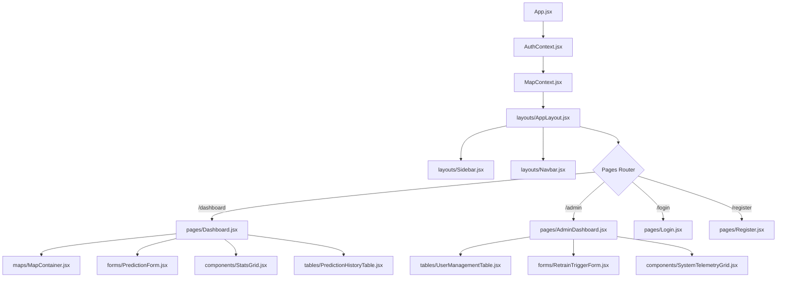

# SafeRoute AI - Frontend UI/UX Redesign Specification

---

| Spec Version | Target Framework | Style Standard | Date |
| :--- | :--- | :--- | :--- |
| **2.0.0** | React 18 / Vite / CSS | Dark SaaS / Glassmorphism | 2026-07-31 |

---

## 1. Primary Design System

This design system establishes a premium, minimalist, and highly aesthetic interface for SafeRoute AI, drawing design inspiration from platforms like Linear, Stripe, and Vercel.

### 1.1 Color Palette (Dark Theme First)

The UI is built exclusively around a refined dark color palette:

```
[Backgrounds]
Primary Background:     #09090B  (Deepest gray/black viewport background)
Secondary Background:   #111827  (Slightly lighter shade for page panels/sidebars)
Cards / Elements:       #18181B  (Container card bases)
Borders / Dividers:     rgba(255,255,255,0.06) (Subtle borders)

[Accents & Status]
Primary Accent:         #3B82F6  (Vibrant Blue for buttons, selection highlights)
Secondary Accent:       #6366F1  (Indigo for primary trends, gradients)
Success Status:         #22C55E  (Emerald for low-risk, valid uploads, system green)
Warning Status:         #F59E0B  (Amber for medium-risk, training candidate models)
Danger Status:          #EF4444  (Rose for critical risk, system issues, errors)

[Text Hierarchy]
Text Primary:           #FFFFFF  (Pure white for headings, core body)
Text Secondary:         #9CA3AF  (Muted gray for labels, descriptive metadata text)
Hover Effect:           rgba(255,255,255,0.04) (Slight highlight overlay)
```

### 1.2 Typography & Spacing (8px Grid)
* **Font Family**: `Inter, system-ui, sans-serif` (imported from Google Fonts).
* **Weights**: `400` (Regular), `500` (Medium), `600` (Semi-Bold), `700` (Bold).
* **Grid**: All margins, paddings, gaps, and layouts align to a base-8 scale:
  * `xs` = 8px (paddings inside inline items, badges).
  * `sm` = 16px (standard gap between layout elements, input padding).
  * `md` = 24px (standard padding inside cards).
  * `lg` = 32px (margins between layout sections).
  * `xl` = 48px (page headers top spacing, map panel margins).

### 1.3 Radii & Shadows
* **Border Radius**: Consistent rounding across all panels, cards, and custom components:
  * Cards / Map Containers: `16px` to `20px` (`rounded-2xl`).
  * Inputs / Buttons / Badges: `8px` (`rounded-lg`).
* **Shadows & Glassmorphism**:
  * Cards use a subtle semi-transparent background combined with a border and backing shadow:
    * `background: rgba(24, 24, 27, 0.7)`
    * `backdrop-filter: blur(12px)`
    * `border: 1px solid rgba(255, 255, 255, 0.06)`
    * `box-shadow: 0 4px 30px rgba(0, 0, 0, 0.4)`

### 1.4 Iconography
* **Library**: `lucide-react`.
* **Rules**: Only outline variants are used, with a stroke width of `2px` and a consistent container dimension of `20px x 20px` (or `16px x 16px` inside badges/buttons).

---

## 2. Updated Directory Structure

The frontend folder layout is organized into feature-driven directories to enforce modularity and prevent file bloat:

```
frontend/src/
├── assets/             # Brand logos, fallback vector graphics
├── components/         # Shared component library
│   ├── ui/             # Atomic components (Button, Input, Badge, Slider, Select)
│   ├── layouts/        # Frame wrappers (AppLayout, DashboardLayout, Sidebar, Navbar)
│   ├── charts/         # Canvas charts (RiskDistributionChart, AverageSpeedChart)
│   ├── maps/           # GIS components (MapContainer, MapLoader, RiskOverlay)
│   ├── forms/          # User fields (PredictionForm, LoginForm, RegisterForm)
│   ├── tables/         # Data tables (PredictionHistoryTable, UserManagementTable)
│   ├── skeletons/      # Loading overlays (SkeletonCard, SkeletonTable, SkeletonMap)
│   ├── modals/         # Confirmation windows (RetrainingTriggerModal, UserRoleModal)
│   ├── empty/          # Empty states (EmptyHistory, EmptyDataset, EmptySearch)
│   ├── feedback/       # Feedback UI (StatusIndicator, ToastNotifier)
│   └── common/         # Utilities (ErrorBoundary, LoadingOverlay)
├── context/            # Global contexts (AuthContext, MapContext, UIContext)
├── hooks/              # Custom hooks (useAuth, useLocalStorage, useDebounce)
├── pages/              # View pages (Login, Register, Dashboard, AdminDashboard, Settings)
├── services/           # Service layer for API integration (api.js, mlService.js)
├── utils/              # Helper functions (formatters, coordinateValidators)
├── App.jsx             # App entry, router definitions
└── main.jsx            # DOM renderer
```

---

## 3. Component Architecture & State Flow

The following diagram defines the layout hierarchy and component relationships for SafeRoute AI:



### 3.1 Global State Management Flow
* **AuthContext**: Manages user authentication tokens, active user profiles, token refresh cycles, and route permissions.
* **MapContext**: Manages active map layers (markers vs heatmaps), target coordinates, selected hotspots, zoom levels, and the geocoding state.
* **API Service Layer**: Axios interceptors handle adding authorization headers, refreshing tokens automatically on `401 Unauthorized` responses, and displaying error toasts.

---

## 4. Screen-by-Screen Specifications

### 4.1 Login / Register View
* **Aesthetics**: Centered card layout with a subtle backing glow. Features floating labels, custom inputs, validation feedback, and Sonner error notifications.
* **Responsive Details**: Desktop layout uses a split-screen design, showing a marketing illustration on the left and the form on the right. Stacks vertically on mobile devices.

### 4.2 Commuter Dashboard View
* **Components**:
  * **Sidebar**: Expands/collapses smoothly (260px to 80px).
  * **Navbar**: Displays a search bar, user notifications, the current date/time, and user profile menus.
  * **Interactive Map**: Centered, dark-themed canvas featuring pulsing prediction markers.
  * **Prediction Form**: A sidebar-aligned container for inputs (averages speed, weather selector, time sliders). Shows a circular probability progress meter on submission.

### 4.3 Admin Portal View
* **Subsections**: Tab-based navigation:
  * **Analytics Grid**: Visualizes historical aggregate statistics using Chart.js.
  * **Dataset Manager**: Drag-and-drop CSV uploader with upload validations and checksum checks.
  * **System Telemetry**: Displays CPU usage, memory usage, API uptime, active DB sessions, and retraining logs.

---

## 5. Google Maps Integration & Fallback Vector System

* **Dark Theme styling**: Utilizes a dark JSON map style (minimal roads, dark gray base, glowing highlights).
* **Marker System**: Uses custom SVG markers with a CSS ripple animation to represent hotspots.
* **Legends**: Overlay displaying Risk Level categories (Low, Medium, High, Critical).
* **Fallback Vector Map**: An interactive SVG map showing a tactical grid map with coordinate markers when Google Maps is unavailable.

---

## 6. Animation Guidelines (Framer Motion)

Animations are subtle and standard:
* **Page Transitions**: Fade in and slide up (`opacity: [0, 1]`, `y: [10, 0]`) in `0.3s` with an `easeOut` curve.
* **Card Hover**: Slight hover scale (`scale: 1.01`, `y: -2`) in `0.2s` with shadow glow shifts.
* **Sidebar Transition**: Sidebar expand/collapse uses spring-physics transitions (`stiffness: 300`, `damping: 30`).
* **Toast Animations**: SONNER handles notifications at the bottom-right, sliding and fading out on click.

---

## 7. Accessibility (WCAG AA Compliance)

* **Contrast**: Text elements use WCAG-compliant high-contrast values.
* **Keyboard Navigation**: Interactive elements support tab navigation, focus indicators, and action triggers via Enter/Space.
* **Screen Readers**: Elements include `aria-label`, `aria-describedby`, and `role` attributes where appropriate.
