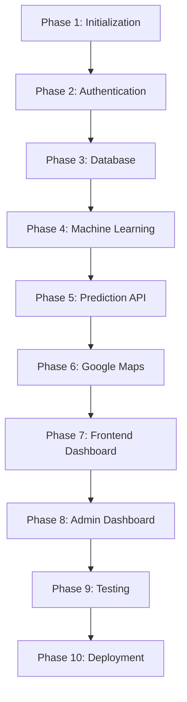

# Project Implementation Sequence

## Project: SafeRoute AI
### AI-Powered Road Accident Hotspot Prediction System

---

| Metric | Details |
| :--- | :--- |
| **Document Version** | 1.0.0 |
| **Status** | Frozen |
| **Author** | SafeRoute AI Lead Project Manager |
| **Date** | 2026-07-27 |
| **Intended Audience** | Lead Developers, Scrum Masters, QA Leads, Product Owners |

---

## Table of Contents
1. [Implementation Strategy](#1-implementation-strategy)
2. [Phases 1-3: Base Infrastructure & Schema Setup](#2-phases-1-3-base-infrastructure--schema-setup)
3. [Phases 4-5: Machine Learning & Prediction Services](#3-phases-4-5-machine-learning--prediction-services)
4. [Phases 6-7: Google Maps & Frontend Dashboard](#4-phases-6-7-google-maps--frontend-dashboard)
5. [Phases 8-10: Admin Controls, Testing & Release](#5-phases-8-10-admin-controls-testing--release)
6. [Assumptions, Risks & Mitigation](#6-assumptions-risks--mitigation)
7. [Best Practices](#7-best-practices)
8. [Revision History](#8-revision-history)
9. [References](#9-references)

---

## 1. Implementation Strategy
SafeRoute AI follows a **10-phase chronological implementation plan**. Each phase is defined with clear objectives, dependencies, and deliverables to ensure a structured development cycle.

---

## 2. Phases 1-3: Base Infrastructure & Schema Setup

### Phase 1: Project Initialization
* **Objectives**: Initialize git, backend python workspace environments, and client-side Vite project layouts.
* **Deliverables**: Git repository, `requirements.txt`, `package.json`, and monorepo workspace directories.
* **Dependencies**: None.
* **Acceptance Criteria**: Running `npm run dev` and Uvicorn start commands locally initialization without errors.
* **Estimated Completion**: Day 1-2.

### Phase 2: Authentication
* **Objectives**: Build registration and login APIs using JWT signed tokens.
* **Deliverables**: `/auth/register` and `/auth/login` API endpoints with associated routers and Pydantic models.
* **Dependencies**: Phase 1.
* **Acceptance Criteria**: Submitting valid user credentials returns signed JWT tokens.
* **Estimated Completion**: Day 3-6.

### Phase 3: Database
* **Objectives**: Setup PostgreSQL databases, configure SQLAlchemy ORM models, and apply Alembic migrations.
* **Deliverables**: Database tables configuration (`users`, `prediction_logs`, `accident_hotspots`) and seed scripts.
* **Dependencies**: Phase 2.
* **Acceptance Criteria**: Running database migration scripts (`alembic upgrade head`) updates schemas.
* **Estimated Completion**: Day 7-10.

---

## 3. Phases 4-5: Machine Learning & Prediction Services

### Phase 4: Machine Learning
* **Objectives**: Create data cleaning and training scripts, and export trained Random Forest models.
* **Deliverables**: Model training script (`train.py`), base training datasets, and serialized output binaries.
* **Dependencies**: Phase 1.
* **Acceptance Criteria**: Running `train.py` outputs `model.joblib` and `scaler.joblib` with validation F1-score >= 82%.
* **Estimated Completion**: Day 11-15.

### Phase 5: Prediction API
* **Objectives**: Create the predictive services layer on the backend and expose evaluation endpoints.
* **Deliverables**: `/predict` and `/predictions/history` endpoints.
* **Dependencies**: Phase 3, Phase 4.
* **Acceptance Criteria**: Submitting features yields risk scores (0-100), classifications, and logs predictions to the database.
* **Estimated Completion**: Day 16-20.

---

## 4. Phases 6-7: Google Maps & Frontend Dashboard

### Phase 6: Google Maps
* **Objectives**: Embed the Google Maps API, and configure heatmap layers and markers.
* **Deliverables**: React maps component (`MapView.jsx`) and custom markers.
* **Dependencies**: Phase 1.
* **Acceptance Criteria**: Google Map renders centered on the default coordinates with color-coded risk markers.
* **Estimated Completion**: Day 21-25.

### Phase 7: Frontend Dashboard
* **Objectives**: Build dashboard cards, login screens, prediction panels, and history logs.
* **Deliverables**: React layouts (`Dashboard.jsx`, `Predict.jsx`, `Login.jsx`, `Register.jsx`).
* **Dependencies**: Phase 5, Phase 6.
* **Acceptance Criteria**: The interface displays risk predictions, interactive maps, safety charts, and user query histories.
* **Estimated Completion**: Day 26-34.

---

## 5. Phases 8-10: Admin Controls, Testing & Release

### Phase 8: Admin Dashboard
* **Objectives**: Build administrative control panels, user logs audit tables, and CSV dataset uploader tools.
* **Deliverables**: React layout (`AdminPanel.jsx`), CSV uploader frontend, and file processing endpoints.
* **Dependencies**: Phase 7.
* **Acceptance Criteria**: Uploading valid CSV datasets processes the files in background tasks, updating model metrics.
* **Estimated Completion**: Day 35-42.

### Phase 9: Testing
* **Objectives**: Execute unit, integration, and E2E browser test suites.
* **Deliverables**: Test files, coverage reports, and QA checklists.
* **Dependencies**: Phase 8.
* **Acceptance Criteria**: Code coverage checks pass >= 85%, and browser functional test suites succeed.
* **Estimated Completion**: Day 43-48.

### Phase 10: Deployment
* **Objectives**: Deploy backend services, database instances, Nginx proxies, and frontend static assets.
* **Deliverables**: Multi-stage Dockerfiles, Docker Compose, and active deployment targets (Vercel & Render).
* **Dependencies**: Phase 9.
* **Acceptance Criteria**: The production application loads, secures endpoints, and passes automated testing suites.
* **Estimated Completion**: Day 49-56 (End of Week 8).

---

## 6. Assumptions, Risks & Mitigation

### 6.1 Assumptions
* Development resources are allocated full-time (40 hours per week) to ensure tasks are completed on schedule.

### 6.2 Implementation Sequence Risks & Mitigation
* **Risk**: Missing Google Maps API credentials with active billing, blocking development in Phase 6.
  * *Mitigation*: Fall back to OpenStreetMap or mock coordinates during the development phase of Phase 6 to avoid blocking tasks.

---

## 7. Best Practices
* **Verify Each Phase**: Complete and verify all acceptance criteria before moving to the next phase in the implementation sequence.
* **Maintain Branch Hygiene**: Work in feature branches that correspond to the current development phase.

## 8. Revision History

| Version | Date | Author | Description |
| :--- | :--- | :--- | :--- |
| **1.0.0** | 2026-07-27 | Project Manager | Initial project implementation sequence and milestones. |

---

## 9. References
1. *Agile Project Scheduling Principles*: https://www.pmi.org/pmbok-guide-standards/foundational/pmbok
2. *FastAPI Development Lifecycle Reference*: https://fastapi.tiangolo.com/tutorial/
3. *Vite Build and Static Asset Guidelines*: https://vite.dev/guide/env-and-mode
