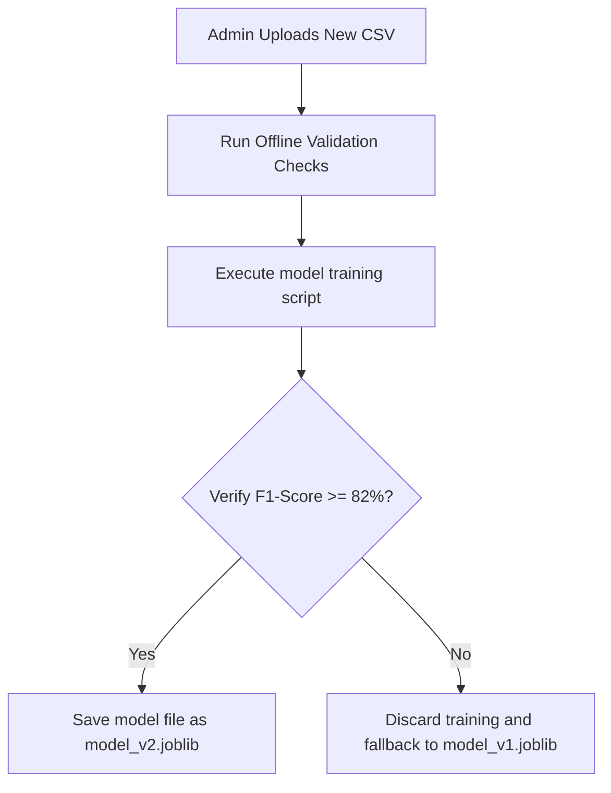

# Machine Learning Pipeline Design Specification

## Project: SafeRoute AI
### AI-Powered Road Accident Hotspot Prediction System

---

| Metric | Details |
| :--- | :--- |
| **Document Version** | 1.0.0 |
| **Status** | Frozen |
| **Author** | SafeRoute AI Lead Machine Learning Engineer |
| **Date** | 2026-07-27 |
| **Intended Audience** | ML Engineers, Backend Developers, Data Scientists |

---

## Table of Contents
1. [Pipeline Overview](#1-pipeline-overview)
2. [Input Dataset Features](#2-input-dataset-features)
3. [Feature Preprocessing & Encoding](#3-feature-preprocessing--encoding)
4. [Model Architecture & Hyperparameters](#4-model-architecture--hyperparameters)
5. [Model Training & Cross-Validation Loops](#5-model-training--cross-validation-loops)
6. [Evaluation Metrics & Thresholds](#6-evaluation-metrics--thresholds)
7. [Inference Pipeline & Risk Formulation](#7-inference-pipeline--risk-formulation)
8. [Model Versioning & Retraining Strategy](#8-model-versioning--retraining-strategy)
9. [Future Model Evolutions](#9-future-model-evolutions)
10. [Assumptions, Risks & Mitigation](#10-assumptions-risks--mitigation)
11. [Revision History](#11-revision-history)
12. [References](#12-references)

---

## 1. Pipeline Overview
The machine learning pipeline for SafeRoute AI classifies road segment risk levels using environmental and traffic features. The design separates the **offline training pipeline** (responsible for training the model and saving the binaries) from the **online inference pipeline** (responsible for real-time predictions).

---

## 2. Input Dataset Features

The model uses a structured training dataset with five input features and one target label:

| Feature Name | Type | Classifications / Ranges | Encoding Approach | Description |
| :--- | :--- | :--- | :--- | :--- |
| **`weather`** | Categorical | `Clear`, `Rainy`, `Snowy`, `Foggy`, `Windy` | One-Hot Encoding | Current weather conditions. |
| **`traffic_density`**| Categorical | `Low`, `Medium`, `High`, `Jammed` | Ordinal Mapping | Levels of road traffic congestion. |
| **`road_type`** | Categorical | `Highway`, `Arterial`, `Local`, `Expressway`| One-Hot Encoding | Road segment classification. |
| **`average_speed`** | Numerical | `0.0` to `200.0` (km/h) | Standard Scaling | Average speed of vehicles on the segment. |
| **`time_of_day`** | Categorical | `Morning`, `Afternoon`, `Evening`, `Night` | One-Hot Encoding | Time block of the day. |
| **`accident`** | Binary | `0` (Safe), `1` (Accident occurred) | None (Target Label) | Classification target. |

---

## 3. Feature Preprocessing & Encoding
1. **Data Cleaning**: Remove rows containing missing values (`null` or `NaN`) in critical features: `weather`, `traffic_density`, `road_type`, `average_speed`, `time_of_day`, and `accident`.
2. **One-Hot Encoding**: Convert categorical features (`weather`, `road_type`, `time_of_day`) into binary indicators, dropping the first category to prevent multi-collinearity.
3. **Ordinal Mapping**: Map `traffic_density` levels to numerical values:
   * `Low` -> `0`
   * `Medium` -> `1`
   * `High` -> `2`
   * `Jammed` -> `3`
4. **Numerical Scaling**: Scale the `average_speed` feature using standard scaling:
   * $z = (x - \mu) / \sigma$ (where $\mu$ is the mean speed and $\sigma$ is the standard deviation).
5. **Preprocessing Pipelines**: Save the encoding and scaling parameters alongside the model binary.

---

## 4. Model Architecture & Hyperparameters
* **Algorithm**: Random Forest Classifier (`sklearn.ensemble.RandomForestClassifier`).
* **Selected Hyperparameters**:
  * `n_estimators = 100` (Number of decision trees).
  * `max_depth = 12` (Limits tree depth to control file size).
  * `min_samples_split = 5` (Minimum samples required to split a node).
  * `random_state = 42` (Fixed seed value to ensure reproducible results).
  * `class_weight = "balanced"` (Adjusts weights to handle imbalanced datasets).

---

## 5. Model Training & Cross-Validation Loops
1. **Train/Test Split**: Split the cleaned training dataset into an 80/20 train/test split.
2. **Cross-Validation**: Perform 5-fold Stratified Cross-Validation on the training split to evaluate performance consistently across folds.
3. **Save Binaries**: If evaluation metrics exceed the defined threshold, serialize the trained model and scaler to the models directory using Joblib.

---

## 6. Evaluation Metrics & Thresholds
To ensure accuracy, trained models must meet the following performance criteria before deployment:
* **F1-Score (Primary Metric)**: Must be `>= 0.82` on validation datasets.
* **Precision**: Target `>= 0.80`.
* **Recall**: Target `>= 0.80`.
* **Deployment Validation**: The training script will block model exports if metrics do not meet these thresholds.

---

## 7. Inference Pipeline & Risk Formulation
1. **Input Payload**: The API receives the prediction features as a JSON payload.
2. **Feature Alignment**: Apply the stored scaling and encoding parameters to the input features.
3. **Prediction Probabilities**: Call the model's prediction probability method to calculate the likelihood of an accident ($P(\text{Accident})$).
4. **Risk Score Formula**:
   $$\text{Risk Score} = \text{round}(P(\text{Accident}) \times 100)$$
5. **Risk Category Mapping**:
   * **Low**: `0` to `25`
   * **Medium**: `26` to `50`
   * **High**: `51` to `75`
   * **Critical**: `76` to `100`

---

## 8. Model Versioning & Retraining Strategy

### 8.1 Model File Versioning
* Model files use semantic versioning (e.g., `model_v1.0.joblib`).
* Deployments include a metadata file (`model_metadata.json`) containing version numbers, training dates, F1-scores, and list of features.

### 8.2 Retraining Strategy
* Retrain models monthly or when administrators upload new CSV training datasets.
* Automated validation tests run before model swaps. If validation scores degrade, the deployment rollbacks to the previous model version.

---

## 9. Future Model Evolutions
* **Stage 2 (XGBoost Integration)**: Transition to XGBoost models when training datasets scale past 100,000 records.
* **Stage 3 (Deep Learning Spatiotemporal Models)**: Transition to recurrent neural networks (RNNs/LSTMs) in later phases to analyze temporal traffic safety patterns.

---

## 10. Assumptions, Risks & Mitigation

### 10.1 Assumptions
* Historical accident records are correctly labeled, and coordinates are accurate.

### 10.2 Machine Learning Risks & Mitigation
* **Risk**: Class imbalance in training datasets (many more "Safe" records than "Accident" records), leading to biased predictions.
  * *Mitigation*: Adjust class weights in the Random Forest model (`class_weight="balanced"`) and evaluate performance using F1-score rather than accuracy.

---

## 11. Revision History

| Version | Date | Author | Description |
| :--- | :--- | :--- | :--- |
| **1.0.0** | 2026-07-27 | ML Lead | Initial machine learning pipeline design, including preprocessing, model parameters, and retraining strategies. |

---

## 12. References
1. *Scikit-Learn Random Forest Classification Manual*: https://scikit-learn.org/stable/modules/ensemble.html#forests-of-randomized-trees
2. *Feature Scaling and Encoding Guidelines*: https://scikit-learn.org/stable/modules/preprocessing.html
3. *Cross-Validation and Validation Split Principles*: https://scikit-learn.org/stable/modules/cross_validation.html
