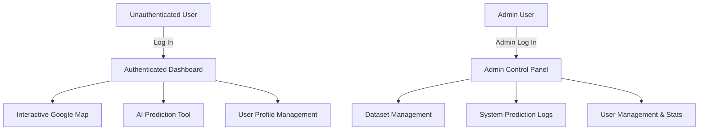

# Product Requirements Document (PRD)

## Project: SafeRoute AI
### AI-Powered Road Accident Hotspot Prediction System

---

| Metric | Details |
| :--- | :--- |
| **Document Version** | 1.0.0 |
| **Status** | Approved |
| **Author** | SafeRoute AI Architecture & Product Team |
| **Date** | 2026-07-27 |
| **Intended Audience** | Engineering Team, Product Managers, UI/UX Designers, QA Team, Project Stakeholders |

---

## Table of Contents
1. [Executive Summary](#1-executive-summary)
2. [Product Vision & Problem Statement](#2-product-vision--problem-statement)
3. [Business Goals & Success Metrics](#3-business-goals--success-metrics)
4. [User Personas](#4-user-personas)
5. [User Stories](#5-user-stories)
6. [Functional Requirements (MVP & Live Driver Mode)](#6-functional-requirements-mvp)
7. [Non-Functional Requirements](#7-non-functional-requirements)
8. [MVP Scope vs. Out-of-Scope (Version 2+)](#8-mvp-scope-vs-out-of-scope-version-2)
9. [Acceptance Criteria](#9-acceptance-criteria)
10. [Risks, Constraints & Assumptions](#10-risks-constraints--assumptions)
11. [Best Practices](#11-best-practices)
12. [Future Scope](#12-future-scope)
13. [Revision History](#13-revision-history)
14. [References](#14-references)

---

## 1. Executive Summary
SafeRoute AI is a machine learning-backed web application designed to predict road accident risk levels and visualize them on an interactive map. By utilizing historical road safety data, traffic parameters, and weather conditions, SafeRoute AI highlights high-risk accident hotspots before incidents occur. The system addresses a critical gap in daily commuting and urban planning by providing preemptive risk visualization for general drivers, daily commuters, traffic police, and municipal city authorities.

## 2. Product Vision & Problem Statement
### 2.1 Product Vision
To create a proactive, visual, and highly accurate road accident hotspot prediction system that shifts road safety from reactive emergency response to proactive accident prevention.

### 2.2 Problem Statement
Traditional road safety measures rely on historical collision mapping and reactive policing after an accident has occurred. Commuters lack dynamic, real-time insights into which segments of their journeys are statistically most dangerous under specific weather and traffic conditions. City authorities and traffic police lack predictive modeling tools to allocate resources effectively before a crash happens.

---

## 3. Business Goals & Success Metrics
### 3.1 Business Goals
* **Accident Reduction**: Assist local municipalities in reducing road accidents by providing data-driven hotspot identification.
* **Proactive Resource Allocation**: Empower traffic police to position patrol units at predicted high-risk zones.
* **Driver Awareness**: Raise commuter awareness regarding dynamic environmental risk factors (e.g., poor weather, high traffic density).

### 3.2 Success Metrics (Key Performance Indicators)
* **Prediction Accuracy**: Achieve a minimum classification F1-Score of 82% on the validation dataset using the initial Random Forest model.
* **User Engagement**: Daily active users (DAU) among pilot city traffic controllers.
* **Response Time**: Map risk calculation API response within 300ms under standard load.
* **Usability Score**: System Usability Scale (SUS) score > 80 from beta testers.

---

## 4. User Personas

| Persona | Role | Primary Goals | Core Pain Points |
| :--- | :--- | :--- | :--- |
| **Sarah Jenkins** | Daily Commuter | Find safer times and routes to commute; assess current road risk before leaving. | Worried about driving in heavy rain and high-density traffic on unfamiliar highway sections. |
| **Officer David Chen** | Traffic Police Sergeant | Deploy patrol officers to areas with the highest risk of collision during peak hours. | Limited resources; relying on gut feeling or legacy paper maps to decide patrol locations. |
| **Elena Rostova** | City Planner / Authority | Review historical risk patterns to plan infrastructure changes (barriers, signs). | Hard to combine traffic speed datasets with weather and crash records to justify budget spend. |

---

## 5. User Stories

### 5.1 Commuter Stories
* **US-101**: As a daily commuter, I want to view my current location's accident risk rating on a Google Map so that I can drive more defensively in high-risk zones.
* **US-102**: As a commuter, I want to input potential trip parameters (time, weather) to check the risk score of a specific road type before departing.

### 5.2 Traffic Police Stories
* **US-201**: As a traffic police officer, I want to see risk-colored markers on the map (Green, Yellow, Red, Dark Red) representing different danger levels so that I can quickly identify where patrol cars are needed.
* **US-202**: As a police administrator, I want to see a localized heatmap of predicted accident risks over the city grid to view cumulative high-probability hotspots.

### 5.3 System Administrator Stories
* **US-301**: As a system administrator, I want to upload new csv datasets containing traffic and weather parameters to retrain the underlying model.
* **US-302**: As an administrator, I want to inspect prediction logs to verify model consistency and monitor user queries.

---

## 6. Functional Requirements (MVP)

### 6.1 Authentication Module
* **Registration**: Users can sign up using Email, Name, and Password.
* **Authentication**: Secure login using JWT tokens.
* **Session Management**: Session persistence in local storage; auto-logout after 24 hours of inactivity.
* **Roles**: Standard User (Drivers, Commuters, Police) and Administrator roles.

#### 6.2 Interactive Dashboard (User Dashboard)
* **SaaS Panel Layout**: Left collapsible sidebar (80px to 260px) housing Navigation links and user profile avatars, top nav with Search, notifications, and telemetry time counters.
* **Current Risk Indicator Card**: Glassmorphism dashboard widget showing dynamic prediction risk index (0-100) alongside animated gauge controls.
* **Weather & Traffic Widgets**: Mini-cards display with visual outline icons and Trend percentage comparisons.
* **Prediction History Log**: High-contrast tables supporting filtering, pagination, and colored badges for risk categorization.
* **Visual Statistics Panel**: Responsive grid containers for Chart.js dashboards showing Risk distribution (donut charts) and historic prediction categories (area charts).

### 6.3 Google Maps & Visualization Module
* **Base Map**: Google Maps JS API styled to dark themes (`#09090B` colors) with rounded borders (16px) and floating controls.
* **Heatmap Overlay**: Dense gradient layer illustrating accident hotspots.
* **Risk-Colored Markers**: Customized glowing circular pins representing safety states:
  * **Low Risk (0-25)**: Emerald Green marker
  * **Medium Risk (26-50)**: Amber Yellow marker
  * **High Risk (51-75)**: Rose Red marker
  * **Critical Risk (76-100)**: Dark Crimson marker
* **Fallback Vector Canvas**: Elegant SVG vector layout representing grid coordinates and hot zones when Maps is unavailable.

### 6.4 AI Prediction Module
* **Predictive Form Panel**: Inline floating layout containing custom drop-downs, animated range sliders (average speed), and weather/traffic selectors.
* **Evaluation Pipeline**: Submits data to backend without reloading the viewport, showing interactive Shimmer Loading Skeletons.
* **Response View**: Shows risk results (score, category) alongside actionable route safety recommendations.

### 6.5 Administrative Module
* **Dataset Workspace**: Multi-stage CSV uploader supporting drag-and-drop actions, checksum verifications, and progress skeletons.
* **Privileged Control Telemetries**: Visual logs showing CPU metrics, memory sizes, database health states, and model retraining controls.
* **User Accounts Console**: Directory grid for role configurations (USER vs ADMIN) and account activations.

---

## 7. Non-Functional Requirements

### 7.1 Performance & Latency
* **API Response Time**: Predicting risk (FastAPI backend + Random Forest inference) must complete in under 150ms.
* **Map Load**: Google Maps rendering and marker clustering must be optimized to load within 2.5 seconds on a standard 4G connection.
* **Concurrency**: Backend must support up to 50 concurrent requests/second without performance degradation.

### 7.2 Security & Compliance
* **Transport Encryption**: All communication must use HTTPS (TLS 1.3).
* **Token Authentication**: Password storage must use bcrypt hashing; authentication via stateless JSON Web Tokens (JWT) signed with HS256.
* **CORS Policies**: Strict Cross-Origin Resource Sharing rules allowing API requests only from trusted frontend domains.
* **SQL Injection Prevention**: Forced use of parameterized queries via SQLAlchemy ORM.

### 7.3 Accessibility
* **WCAG Compliance**: Frontend components must achieve WCAG 2.1 Level AA compliance (contrast ratios, screen reader tag support, keyboard navigability).
* **Responsive Layouts**: Full mobile and desktop responsiveness using Tailwind CSS grids and flex layouts.

---

## 8. MVP Scope vs. Out-of-Scope (Version 2+)

To ensure project delivery within timelines, the project boundaries are strictly defined.

| Feature Area | In-Scope (MVP V1) | Out-of-Scope (V2+) |
| :--- | :--- | :--- |
| **Maps & Routing** | Google Maps JavaScript API, static markers, and heatmaps. | GPS Navigation, Route Optimization, turn-by-turn alerts. |
| **Traffic Integration** | Manual traffic density inputs and mock database profiles. | Google Traffic API, HERE Maps Live API, TomTom Live APIs. |
| **User Interfaces** | React Desktop & Responsive Mobile Web Dashboard. | Native Android/iOS applications, Wearables, Android Auto. |
| **AI / Chatbots** | Form-based inputs sending parameters to Random Forest. | AI chatbot assistants, Natural Language Processing search. |
| **CCTV & Hardware** | Static prediction data upload. | CCTV live feed computer vision, IoT speed sensors, vehicle telematics. |
| **Public Services** | Admin Dashboard for municipal operators. | Emergency dispatch automatic integration, live siren triggers. |

---

## 9. Acceptance Criteria

* **AC-AUTH-01**: A user cannot access `/dashboard` or `/predict` routes without a valid JWT authorization token.
* **AC-MAP-01**: Map markers must change color based on the risk score returned by the database/model API (Green, Yellow, Orange, Red).
* **AC-PRED-01**: Manual prediction must validate inputs. If average speed is negative or greater than 200 km/h, the interface must reject the query with a clear validation error message.
* **AC-ADMIN-01**: Only accounts with user type `admin` can access the `/admin` workspace. Standard users attempting to load `/admin` must be redirected to `/dashboard` with an access denied toast warning.

---

## 10. Risks, Constraints & Assumptions

### 10.1 Assumptions
* **Google Maps Billing**: It is assumed that the client will provide a valid Google Maps API Key with active billing enabled.
* **Historical Data Quality**: It is assumed that historical accident datasets contain correct mapping features (Latitude, Longitude) and environmental parameters.

### 10.2 Constraints
* **Inference Library**: The ML model must be lightweight enough to run within Python's thread limits on typical container CPU resources (e.g., Vercel Serverless or Free-tier Render containers).
* **No Client-side Cache**: Map features must refresh data on page load to ensure data is current.

### 10.3 Risks & Mitigation Strategies
* **Risk**: High latency during bulk database query for map markers.
  * *Mitigation*: Introduce geographic bounding-box queries (`geom` bounding box coordinates) and limit maximum map markers to 500 per view using marker clustering.
* **Risk**: Overfitting of Random Forest model on historical training sets.
  * *Mitigation*: Run strict 5-fold cross-validation and audit feature importance scores before deployment.

---

## 11. Best Practices
* **Keep Code Clean**: Adhere to PEP 8 standards on the backend and ESLint Airbnb guidelines on the frontend.
* **Secure Secrets**: Under no circumstances commit private key configurations, database credentials, or Google Maps client IDs to version control. Use environment variables.
* **Design Responsively**: Develop layouts using a mobile-first philosophy to ensure usability across low-cost tablets and patrol-car mounted tablets.

## 12. Future Scope
* **Live Traffic Feeds**: Real-time traffic ingestion through public municipal API integration.
* **Route Recommendation Engine**: A routing service that routes drivers away from critical risk zones.
* **Telematics SDK**: IoT/Mobile client SDK to track driver speeds and adjust risk scoring in real-time.

## 13. Revision History

| Version | Date | Author | Description |
| :--- | :--- | :--- | :--- |
| **1.0.0-draft** | 2026-07-27 | SafeRoute AI Architecture Team | Initial PRD draft defining MVP scope and out-of-scope boundaries. |
| **1.0.0** | 2026-07-27 | SafeRoute AI Product Board | Approved document as system source of truth. |

---

## 14. References
1. *Google Maps JavaScript API Documentation*: https://developers.google.com/maps/documentation/javascript
2. *Scikit-Learn Random Forest Classifier Guide*: https://scikit-learn.org/stable/modules/generated/sklearn.ensemble.RandomForestClassifier.html
3. *FastAPI Design Guidelines*: https://fastapi.tiangolo.com/
