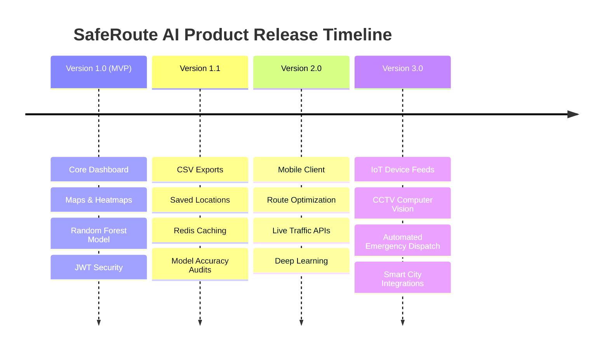

# Product Evolution Roadmap

## Project: SafeRoute AI
### AI-Powered Road Accident Hotspot Prediction System

---

| Metric | Details |
| :--- | :--- |
| **Document Version** | 1.0.0 |
| **Status** | Approved |
| **Author** | SafeRoute AI Product Board & PM Team |
| **Date** | 2026-07-27 |
| **Intended Audience** | Stakeholders, Investors, Engineering Lead, Product Managers |

---

## Table of Contents
1. [Executive Roadmap Summary](#1-executive-roadmap-summary)
2. [Visual Release Timeline](#2-visual-release-timeline)
3. [Version 1.0 (MVP) - Core Platform (Months 1-2)](#3-version-10-mvp---core-platform-months-1-2)
4. [Version 1.1 - Usability & Optimization (Month 3)](#4-version-11---usability--optimization-month-3)
5. [Version 2.0 - Mobility & Integration (Months 4-7)](#5-version-20---mobility--integration-months-4-7)
6. [Version 3.0 - Intelligent City Ecosystems (Months 8-12)](#6-version-30---intelligent-city-ecosystems-months-8-12)
7. [Assumptions, Risks & Mitigation](#7-assumptions-risks--mitigation)
8. [Best Practices](#8-best-practices)
9. [Revision History](#9-revision-history)
10. [References](#10-references)

---

## 1. Executive Roadmap Summary
SafeRoute AI is designed to scale from a predictive road accident visualization tool to an interactive, real-time safety routing platform. This roadmap details the product timeline, release phases, machine learning goals, and technical milestones for our next four deployment cycles.

---

## 2. Visual Release Timeline

The milestone timeline outlines the progression of features, platforms, and capabilities.

---

## 3. Version 1.0 (MVP) - Core Platform (Months 1-2)
* **Goal**: Establish the base infrastructure, deploy predictions, and display hazards on interactive maps.

### Key Capabilities
* **Interactive Map Visualization**: Renders dark-themed Google Maps JS layouts with glowing custom markers and legends. Offers a grid-based fallback vector map.
* **Premium SaaS Dashboard**: Collagen-sidebar navigation, user avatars, top telemetry bars, and interactive widgets.
* **Manual Prediction Interface**: Custom Select sliders and floating-labeled dropdown inputs. Renders circular progress metrics.
* **Skeleton Shimmer Loading**: Utilizes loading skeletons for async cards, lists, tables, and map layers.
* **Authentication**: Login and registration paths secured with JSON Web Tokens (JWT).
* **Admin Dashboard**: Multi-stage CSV uploader, role configuration tables, and CPU system metrics logs.

### Technical & ML Specifications
* **Infrastructure**: Deploy the React client to Vercel, and run the FastAPI backend inside Docker containers on Railway.
* **Model**: Train a Scikit-Learn Random Forest Classifier model locally.
* **Target Metric**: Achieve an F1-Score of > 82% on validation datasets.

---

## 4. Version 1.1 - Usability & Optimization (Month 3)
* **Goal**: Refine user flows, optimize page loads, and introduce data sharing and exporting features.

### Key Capabilities
* **Saved Locations & Pinning**: Allow commuters to bookmark coordinates or frequent routes (e.g., Home to Office).
* **Data Export Utilities**: Enable administrators to export prediction log history in CSV or PDF format.
* **Alert Notifications**: Display browser toast notifications when local weather conditions change, indicating potential shifts in route risks.

### Technical & ML Specifications
* **Infrastructure**: Integrate Redis caching to store frequently accessed hotspot coordinates, reducing database load.
* **Model**: Automate model re-training tasks using cron scripts that run whenever new datasets are uploaded.
* **Target Metric**: Reduce API response times for map visualisations to under 150ms.

---

## 5. Version 2.0 - Mobility & Integration (Months 4-7)
* **Goal**: Transition from manual inputs to real-time automated tracking, launch mobile applications, and provide route optimization.

### Key Capabilities
* **Automated Route Optimization**: Recommend alternative routes to bypass high-risk zones, integrating navigation suggestions.
* **Companion Mobile Application**: Launch native Android and iOS mobile applications built using React Native.
* **Live Traffic API Ingestion**: Integrate live traffic feeds from services like HERE Maps or TomTom to dynamically update traffic density values.

### Technical & ML Specifications
* **Infrastructure**: Set up a message broker (RabbitMQ or Kafka) to ingest real-time traffic updates.
* **Model**: Transition the prediction engine from Random Forest to XGBoost or deep learning models (PyTorch) to analyze complex spatiotemporal patterns.
* **Target Metric**: Maintain model prediction accuracy > 88% under volatile weather conditions.

---

## 6. Version 3.0 - Intelligent City Ecosystems (Months 8-12)
* **Goal**: Establish connections with municipal infrastructure, utilize CCTV computer vision pipelines, and integrate with emergency services.

### Key Capabilities
* **CCTV Video Analysis**: Connect live public camera feeds to computer vision models (YOLO) to detect traffic bottlenecks or lane obstructions.
* **Smart City Integrations**: Exchange safety data directly with municipal traffic management systems.
* **Automated Emergency Dispatch**: Share crash coordinates directly with police and emergency response services when an incident is detected.
* **Vehicle Telematics Integration**: Connect with vehicles using OBD-II or Android Auto platforms to alert drivers to incoming hazards.

### Technical & ML Specifications
* **Infrastructure**: Deploy edge computing nodes to run video analytics closer to the source cameras.
* **Model**: Implement multi-modal learning pipelines that combine video feeds, historical data, and real-time weather logs.
* **Target Metric**: Process live video streams with latency under 50ms.

---

## 7. Assumptions, Risks & Mitigation

### 7.1 Assumptions
* The project secures necessary funding to support mobile app development and third-party API licenses in Phase 2.

### 7.2 Roadmap Risks & Mitigation
* **Risk**: High costs associated with real-time traffic APIs (e.g., Google Traffic API).
  * *Mitigation*: Leverage open-source traffic data from OpenStreetMap and local government feeds where possible to minimize costs.

---

## 8. Best Practices
* **User-Centric Refinements**: Gather user feedback during early release stages to guide the prioritization of upcoming features.
* **Scalable Architecture**: Keep APIs stateless to simplify horizontal scaling as the platform grows.

## 9. Revision History

| Version | Date | Author | Description |
| :--- | :--- | :--- | :--- |
| **1.0.0** | 2026-07-27 | Product Board | Approved roadmap for V1 core release and planning definitions through V3. |

---

## 10. References
1. *TomTom Traffic API Pricing Docs*: https://developer.tomtom.com/traffic-api/
2. *React Native Cross-Platform Guidelines*: https://reactnative.dev/docs/getting-started
3. *YOLO Real-Time Object Detection Specs*: https://pjreddie.com/darknet/yolo/
