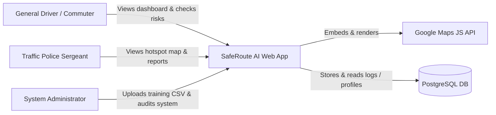
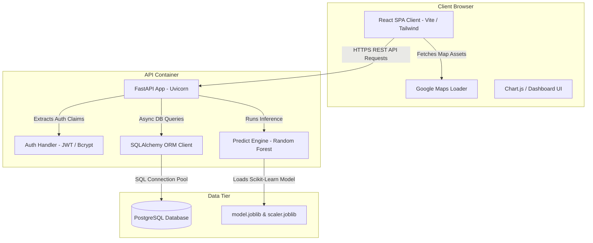
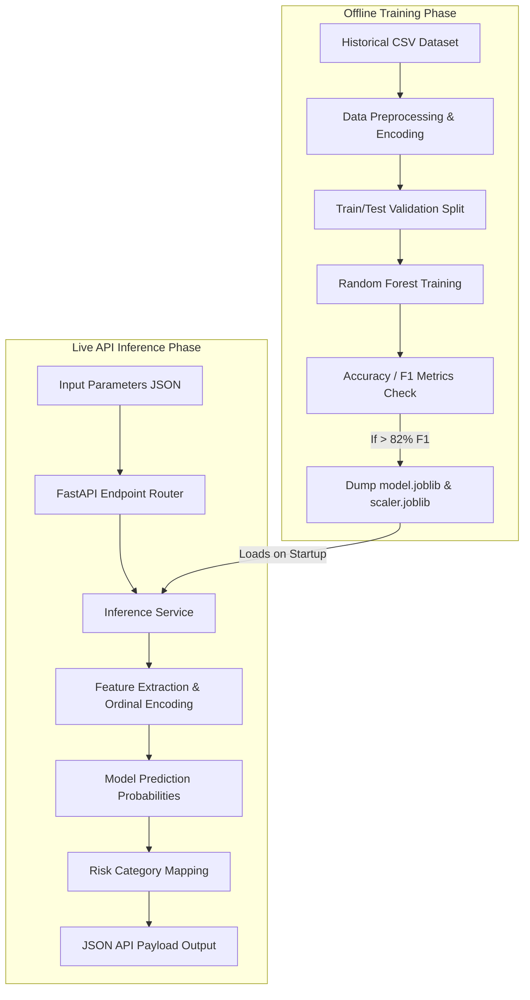
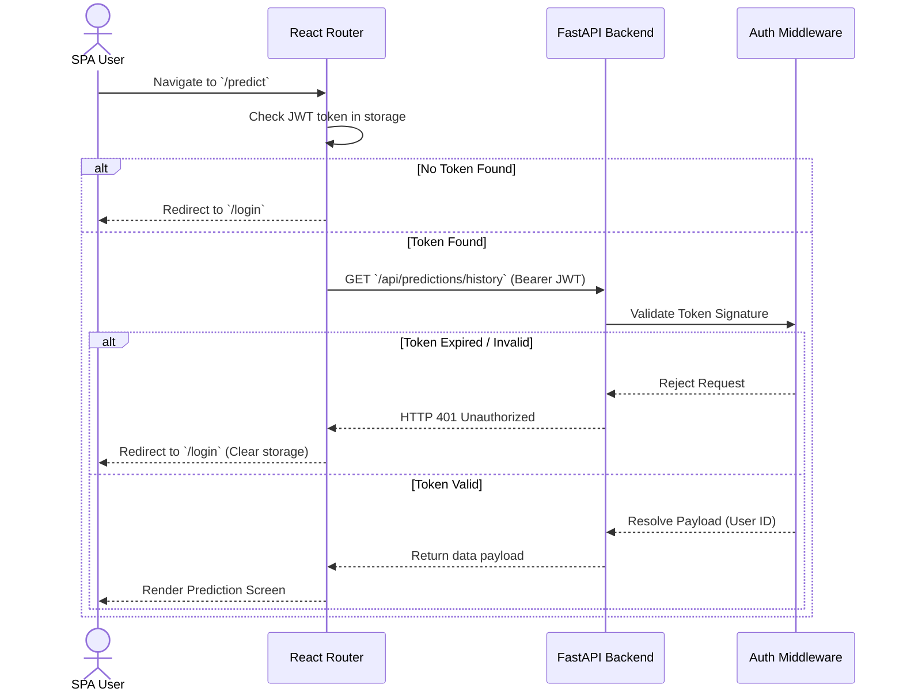
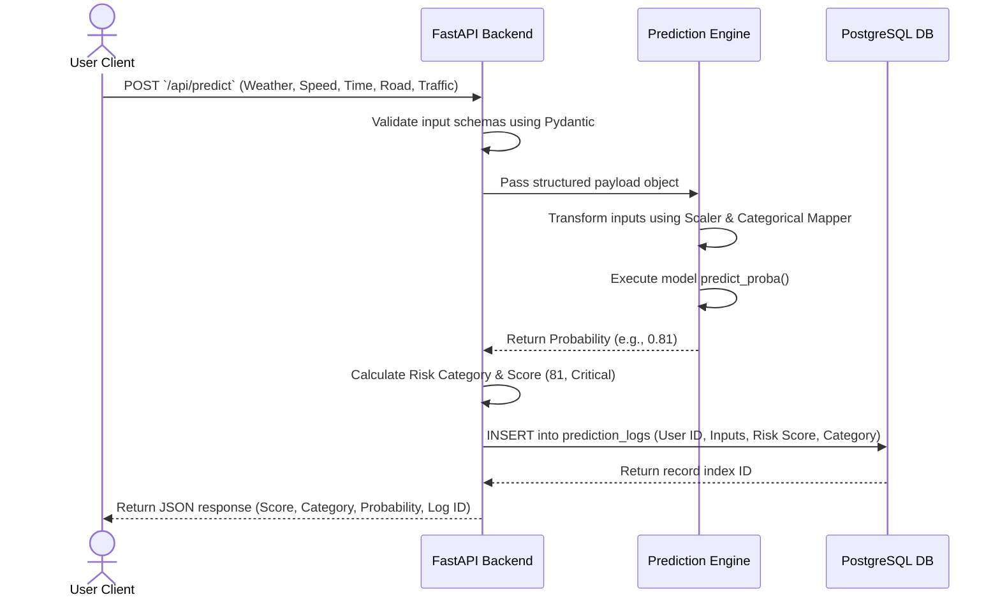

# System Design Document (SDD)

## Project: SafeRoute AI
### AI-Powered Road Accident Hotspot Prediction System

---

| Metric | Details |
| :--- | :--- |
| **Document Version** | 1.0.0 |
| **Status** | Approved |
| **Author** | SafeRoute AI Lead System Designer |
| **Date** | 2026-07-27 |
| **Intended Audience** | Lead Developers, System Operators, Security Assessors, Integration Teams |

---

## Table of Contents
1. [Introduction & Purpose](#1-introduction--purpose)
2. [High-Level Architecture (C4 Model Context)](#2-high-level-architecture-c4-model-context)
3. [Component Architecture (Containers)](#3-component-architecture-containers)
4. [Frontend Design & Layering](#4-frontend-design--layering)
5. [Backend Design & API Layering](#5-backend-design--api-layering)
6. [Machine Learning Pipeline Architecture](#6-machine-learning-pipeline-architecture)
7. [Sequence Flows](#7-sequence-flows)
8. [Deployment & Network Architecture](#8-deployment--network-architecture)
9. [Security, Logging & Error Handling Framework](#9-security-logging--error-handling-framework)
10. [Scalability & High Availability Decisions](#10-scalability--high-availability-decisions)
11. [Assumptions, Risks & Mitigation](#11-assumptions-risks--mitigation)
12. [Best Practices](#12-best-practices)
13. [Future Architecture Roadmap](#13-future-architecture-roadmap)
14. [Revision History](#14-revision-history)
15. [References](#15-references)

---

## 1. Introduction & Purpose
This System Design Document (SDD) provides a structural description of the SafeRoute AI application. It decomposes the system into frontend UI modules, FastAPI backend APIs, machine learning pipelines, and PostgreSQL database configurations. It maps data flow, component topologies, and execution contracts to serve as a comprehensive blueprints for development.

---

## 2. High-Level Architecture (C4 Model Context)

The context diagram outlines the boundaries of SafeRoute AI, identifying actors and system integrations.

---

## 3. Component Architecture (Containers)

The container diagram displays internal applications, data stores, and communication pathways.

---

## 4. Frontend Design & Layering
The frontend client utilizes a highly decoupled, modular structure. It separates layout presentation layers from application state logic, API integrations, and asset utilities.

* **Routing & Authentication Guards**: Handled by `react-router-dom`, protecting path segments (`/dashboard`, `/admin`) using `ProtectedRoute` wraps that check profile claims in the global `AuthContext`.
* **State Management Contexts**:
  * **`AuthContext`**: Handles session tokens, auto-refresh limits, and roles routing.
  * **`MapContext`**: Controls active coordinates, selected hotspots, zoom scopes, and overlays.
* **Component Layering Categories**:
  * **`ui/`**: Atomic, stateless elements (custom Select menus, Slider ranges, buttons).
  * **`layouts/`**: Sidebar menu collapse panels (80px to 260px), top telemetry headers.
  * **`maps/`**: Handles loading state via `MapLoader` and canvas overlays (`RiskOverlay`).
  * **`charts/`**: Clean wrappers utilizing Chart.js with responsive scales (Donut, Area graphs).
  * **`skeletons/`**: Shimmer layouts matching card shapes (`SkeletonCard`, `SkeletonTable`).
  * **`services/`**: Connection services using Axios interceptors to refresh sessions.

---

## 5. Backend Design & API Layering
The FastAPI backend follows a decoupled controller-service-repository design pattern.

* **Controller Layer (Routers)**: Defines endpoints, parses URI query parameters, and validates payload requests using Pydantic models.
* **Service Layer**: House business rules. The `PredictService` orchestrates feature conversions and runs inferences against the Scikit-Learn pipeline.
* **Repository Layer (ORM Models)**: Interacts with the database using SQLAlchemy, managing schema mapping, transaction isolation, and executing raw queries when analytical reports are generated.

---

## 6. Machine Learning Pipeline Architecture

The Machine Learning subsystem maintains clean pipelines for training models offline and serving predictions online.

---

## 7. Sequence Flows

### 7.1 Authentication & Authorization Flow
Demonstrates step-by-step verification when users access authenticated views.

### 7.2 Core Prediction Execution Flow
The detailed flow when a dashboard user requests a risk prediction query.

---

## 8. Deployment & Network Architecture
The production topology relies on virtual separation of services to enforce scalability.

* **Domain Routing**: Cloudflare DNS manages domain forwarding.
* **Frontend Web Application**: Built static React assets are hosted directly on **Vercel** CDN networks.
* **Application API Gateway**: The FastAPI container, PostgreSQL instance, and Nginx proxy are coordinated using Docker Compose on **Render** or **Railway** virtual machines.
* **Nginx Gateway**: Intercepts inbound calls on port `80/443`, decrypts SSL using certificate files (Let’s Encrypt), and routes requests matching prefix `/api/*` to the FastAPI backend service.

---

## 9. Security, Logging & Error Handling Framework

### 9.1 Authentication Security
* Private keys for signing JWT tokens are loaded directly from environments. Under no circumstances are fallback default string keys maintained in source repositories.
* Bcrypt is utilized for verification. Hashes are run with a work factor value of `12`.

### 9.2 Centralized Logging Design
* A standard middleware class intercepts every API call on the FastAPI service, recording request IP addresses, response status codes, execution latency, and agent strings.
* Uncaught execution issues (`500` errors) are caught using wrapper exception hooks, masking stack traces from API payloads, returning a tracking ID, and outputting details into application log streams.

---

## 10. Scalability & High Availability Decisions
* **Database Connection Reuse**: Enforce SQLAlchemy connection pooling to reuse database sockets, avoiding database connection exhaust under spikes of active map queries.
* **Static Client CDN Routing**: Deploying SPA clients onto Vercel offloads static asset serving workloads, allowing CPU resources to be dedicated exclusively to ML inference processing on the API servers.

---

## 11. Assumptions, Risks & Mitigation

### 11.1 Assumptions
* Google Maps API quota limits are configured to scale automatically to handle load spikes during peak traffic hours.

### 11.2 Architectural Risks & Mitigation
* **Risk**: Excessive CPU load during predictions if requests scale linearly.
  * *Mitigation*: Random Forest calculations are lightweight compared to deep neural networks, but backend processes are wrapped in async workers using Gunicorn to route workloads over multiple core workers.

---

## 12. Best Practices
* **Keep Controllers Light**: Keep controllers thin and place core ML operations and database transaction handling code inside dedicated service modules.
* **Keep Databases Clean**: Enforce constraints, data validation rules, and indexes at the database engine level, treating the database as the ultimate guardian of data integrity.

## 13. Future Architecture Roadmap
* Implement Redis cache keys for static map locations (e.g., historical segments) to achieve 99% cache hits for base map load operations.
* Transition prediction services to serverless cloud functions (AWS Lambda or GCP Cloud Run) when the app experiences highly volatile temporal loads.

## 14. Revision History

| Version | Date | Author | Description |
| :--- | :--- | :--- | :--- |
| **1.0.0** | 2026-07-27 | Lead System Designer | Core System Design blueprint finalized. |

---

## 15. References
1. *C4 Model Architecture Standards*: https://c4model.com/
2. *Nginx Reverse Proxy Configurations*: https://nginx.org/en/docs/http/ngx_http_proxy_module.html
3. *FastAPI Middleware Framework*: https://fastapi.tiangolo.com/tutorial/middleware/
