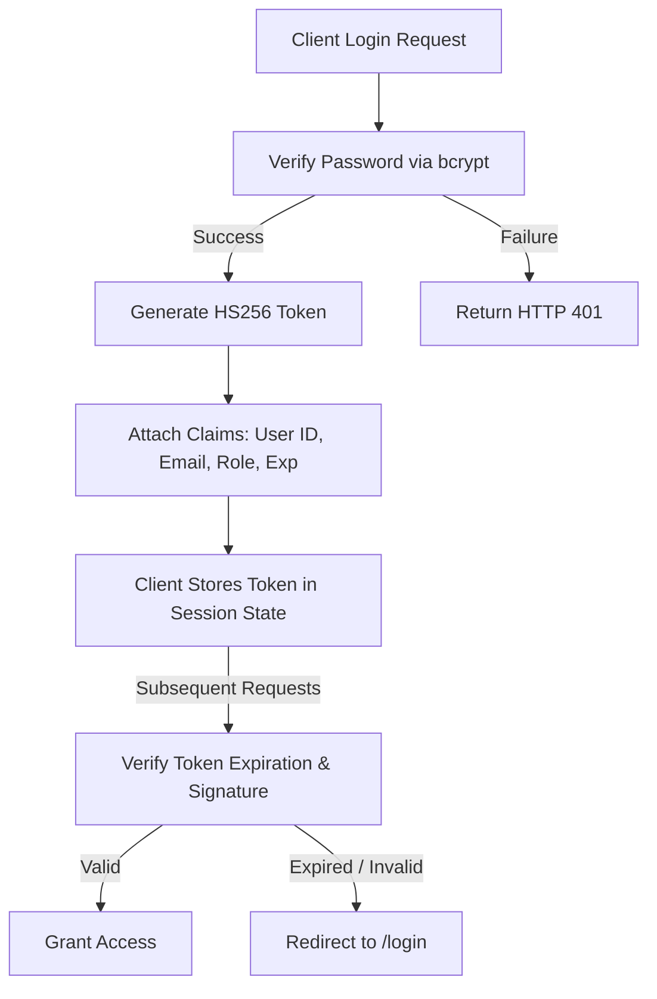

# Security Architecture & Guidelines

## Project: SafeRoute AI
### AI-Powered Road Accident Hotspot Prediction System

---

| Metric | Details |
| :--- | :--- |
| **Document Version** | 1.0.0 |
| **Status** | Approved |
| **Author** | SafeRoute AI Security Architect |
| **Date** | 2026-07-27 |
| **Intended Audience** | Infrastructure Operators, Backend Developers, Security Reviewers |

---

## Table of Contents
1. [Security Mission Statement](#1-security-mission-statement)
2. [Threat Modeling (OWASP API Top 10 Mappings)](#2-threat-modeling-owasp-api-top-10-mappings)
3. [Authentication Security & JWT Lifecycle](#3-authentication-security--jwt-lifecycle)
4. [Data Storage & Transit Protection](#4-data-storage-and-transit-protection)
5. [CSV File Upload Validation (Admin)](#5-csv-file-upload-validation-admin)
6. [Logging Security & PII Protection](#6-logging-security--pii-protection)
7. [Assumptions, Risks & Mitigation](#7-assumptions-risks--mitigation)
8. [Best Practices](#8-best-practices)
9. [Revision History](#9-revision-history)
10. [References](#10-references)

---

## 1. Security Mission Statement
SafeRoute AI processes road safety data, user prediction history, and user profile information. The goal of this security guidelines document is to establish security controls that ensure data integrity, prevent unauthorized access to administrative functions, protect API endpoints from abuse, and secure transport layers.

---

## 2. Threat Modeling (OWASP API Top 10 Mappings)

To address potential vulnerabilities, the system implements specific controls mapped to the OWASP API Security Top 10:

### 2.1 API-1: Broken Object Level Authorization (BOLA)
* **Threat**: A user attempts to view another commuter's prediction log history by guessing the prediction record UUID.
* **Control**: The backend filters prediction log queries by the authenticated user's ID (`user_id`), retrieved from the JWT token.
  ```python
  # Example Repository Query logic
  stmt = select(PredictionLog).where(
      PredictionLog.id == prediction_id,
      PredictionLog.user_id == current_user.id
  )
  ```

### 2.2 API-2: Broken Authentication
* **Threat**: Brute-force attacks target the login endpoint to guess user passwords.
* **Control**: The API enforces rate limiting (maximum 5 requests per minute per IP on `/auth/login`) and secures password storage using bcrypt with a work factor of 12.

### 2.3 API-3: Broken Object Level Authorization (BOLA) - Admin Routes
* **Threat**: A standard user attempts to upload datasets by calling administrative API routes.
* **Control**: Implement role checks in the authorization middleware. The backend verifies that the role claim in the JWT is set to `admin` before granting access.

### 2.4 API-4: Unrestricted Resource Consumption
* **Threat**: Attackers flood the prediction endpoints to cause database connection exhaustion or high CPU utilization.
* **Control**: Enforce rate limits using Redis-based token buckets, limiting users to 60 prediction requests per minute.

### 2.5 API-8: Security Misconfiguration
* **Threat**: Debugging modes expose internal variables, API secrets, or stack traces in error responses.
* **Control**: Disable FastAPI debugging mode in production (`debug=False`). Validate payload structures using Pydantic, returning clean `422 Unprocessable Entity` statuses for validation errors.

---

## 3. Authentication Security & JWT Lifecycle



### 3.1 Token Details
* **Algorithm**: Signed using HMAC-SHA256 (`HS256`).
* **Expiration**: Fixed at 24 hours. The client-side application must clear stored tokens and redirect to login when a token expires.
* **Storage**: In React, store tokens in memory (React Context state) and fall back to session storage. Avoid persistent localStorage to reduce vulnerability to Cross-Site Scripting (XSS) attacks.

---

## 4. Data Storage & Transit Protection
* **Data in Transit**: HTTPS with TLS 1.3 is enforced. Configure Nginx proxy setups to automatically redirect HTTP calls to HTTPS.
* **Data at Rest**: Encrypt PostgreSQL databases using cloud provider storage encryption (AES-256). Secure S3 backup buckets with Server-Side Encryption (SSE-S3).

---

## 5. CSV File Upload Validation (Admin)
To prevent malicious uploads or denial of service attacks through administrative CSV upload endpoints:
* **Size Limits**: Limit uploaded file sizes to a maximum of 10MB.
* **MIME Verification**: Validate the inbound content type header, accepting only `text/csv`.
* **Data Validation**: Parse uploaded CSV rows line-by-line using Pandas. Verify that columns match the expected training data structure before saving changes.

---

## 6. Logging Security & PII Protection
* **Mask PII**: Do not write sensitive user information, such as passwords or raw email strings, to application log files.
* **Trace Tokens**: Do not log raw JWT strings in console outputs or debug logs.
* **Auditing**: Log all administrative actions (e.g., CSV uploads, role changes) to audit logs, capturing the administrator's ID, the IP address, and a timestamp.

---

## 7. Assumptions, Risks & Mitigation

### 7.1 Assumptions
* JWT signing keys are managed securely using cloud secrets managers (e.g., AWS Secrets Manager or Render Environment Settings) and are rotated annually.

### 7.2 Security Risks & Mitigation
* **Risk**: The frontend is vulnerable to Cross-Site Scripting (XSS) attacks, exposing stored authentication tokens.
  * *Mitigation*: Enforce Content Security Policies (CSP) via Nginx and validate all user inputs on the frontend to sanitize potential injection scripts.

---

## 8. Best Practices
* **Least Privilege Access**: Grant only the minimum permissions necessary for users to perform their roles.
* **Regular Dependencies Audits**: Run dependency scanners (e.g., `pip-audit` or `npm audit`) to identify and resolve vulnerabilities in third-party libraries.

## 9. Revision History

| Version | Date | Author | Description |
| :--- | :--- | :--- | :--- |
| **1.0.0** | 2026-07-27 | Security Architect | Initial security architecture guidelines and OWASP threat models. |

---

## 10. References
1. *OWASP API Security Top 10 (2023)*: https://owasp.org/www-project-api-security/
2. *Bcrypt Hashing Recommendations*: https://cheatsheetseries.owasp.org/cheatsheets/Password_Storage_Cheat_Sheet.html
3. *Content Security Policy Reference Guide*: https://content-security-policy.com/
