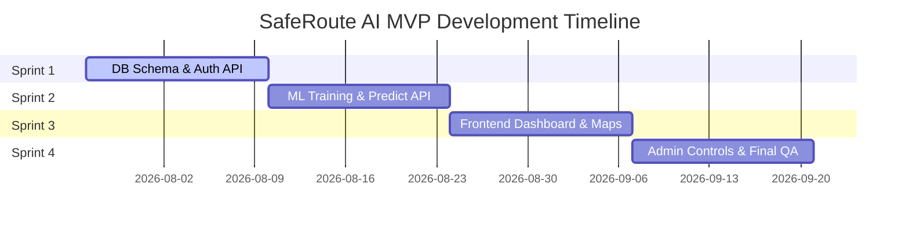

# Agile Task Breakdown & Sprints

## Project: SafeRoute AI
### AI-Powered Road Accident Hotspot Prediction System

---

| Metric | Details |
| :--- | :--- |
| **Document Version** | 1.0.0 |
| **Status** | Approved |
| **Author** | SafeRoute AI Technical Project Manager |
| **Date** | 2026-07-27 |
| **Intended Audience** | Developers, Scrum Masters, QA Leads, Product Owners |

---

## Table of Contents
1. [Release Roadmap & Milestones](#1-release-roadmap--milestones)
2. [Sprint 1: Base Foundations, Schema & Authentication (Weeks 1-2)](#2-sprint-1-base-foundations-schema--authentication-weeks-1-2)
3. [Sprint 2: Backend Core Services & ML Pipeline (Weeks 3-4)](#3-sprint-2-backend-core-services--ml-pipeline-weeks-3-4)
4. [Sprint 3: Frontend Layouts, Dashboard & Map (Weeks 5-6)](#4-sprint-3-frontend-layouts-dashboard--map-weeks-5-6)
5. [Sprint 4: Admin, Stats Panel & System Integration (Weeks 7-8)](#5-sprint-4-admin-stats-panel--system-integration-weeks-7-8)
6. [Assumptions, Risks & Mitigation](#6-assumptions-risks--mitigation)
7. [Best Practices](#7-best-practices)
8. [Revision History](#8-revision-history)
9. [References](#9-references)

---

## 1. Release Roadmap & Milestones
Development is planned across 4 sprints of 2 weeks each, totaling 8 weeks.

### Key Milestones
* **Milestone 1 (End of Sprint 1)**: Database schemas applied locally and authentication endpoints verified using Swagger UI.
* **Milestone 2 (End of Sprint 2)**: Random Forest model outputting predictions through standard API responses.
* **Milestone 3 (End of Sprint 3)**: Google Maps rendering responsive heatmaps and interactive pins.
* **Milestone 4 (End of Sprint 4)**: Complete MVP integration ready, tested, and deployed to production environments.

---

## 2. Sprint 1: Base Foundations, Schema & Authentication (Weeks 1-2)
* **Goal**: Establish the development workspace, set up PostgreSQL databases, configure Alembic migrations, and deploy authentication endpoints.

### Tasks Table

| Task ID | Title & Description | Priority | Dependencies | Est. Time | Deliverables | Acceptance Criteria |
| :--- | :--- | :--- | :--- | :--- | :--- | :--- |
| **TS1-01** | **Repository Initialization & Config** Set up git, backend python dependencies, and Vite frontend workspace files. | High | None | 8h | Initial repository structure. | Lint and formatting checkers run without errors on both client and server directories. |
| **TS1-02** | **PostgreSQL Schema Deployment** Define SQLAlchemy base model classes and execute migrations using Alembic. | High | TS1-01 | 16h | Alembic migration scripts and databases configured. | Tables (`users`, `prediction_logs`, `accident_hotspots`) generated with correct keys and indexes. |
| **TS1-03** | **Authentication APIs** Create `/auth/register` and `/auth/login` endpoints with bcrypt verification and JWT generation. | High | TS1-02 | 24h | FastAPI auth endpoints. | Submitting credentials returns a JWT token with correct claims and 24-hour expiration time. |
| **TS1-04** | **Auth Client Routing** Implement sign-up/login forms on React, and configure JWT storage utilities. | High | TS1-03 | 24h | Login/registration UI screens. | Valid token saves in user session; unauthenticated attempts redirect automatically to login. |

---

## 3. Sprint 2: Backend Core Services & ML Pipeline (Weeks 3-4)
* **Goal**: Create backend services, configure offline model training, and expose model predictions via endpoints.

### Tasks Table

| Task ID | Title & Description | Priority | Dependencies | Est. Time | Deliverables | Acceptance Criteria |
| :--- | :--- | :--- | :--- | :--- | :--- | :--- |
| **TS2-01** | **ML Training Pipeline Script** Create `train.py` to train a Random Forest model on historical CSV files. | High | TS1-01 | 24h | `train.py` script and serialized model binaries. | Executing script builds and saves `model.joblib` and `scaler.joblib` with validation F1-score > 82%. |
| **TS2-02** | **Risk Evaluation Endpoint** Build `POST /predict` endpoint to load binaries, process input features, and return risk categorizations. | High | TS2-01, TS1-03 | 24h | `/predict` API endpoint. | Querying with parameters yields risk scores between 0-100, correct categories, and logs to DB. |
| **TS2-03** | **History Access Endpoint** Build `GET /predictions/history` to retrieve user prediction history logs. | Medium | TS1-03, TS2-02 | 16h | `/predictions/history` API. | Endpoint returns paginated JSON logs for the authenticated user, matching sorting parameters. |

---

## 4. Sprint 3: Frontend Layouts, Dashboard & Map (Weeks 5-6)
* **Goal**: Build frontend dashboard interfaces, configure responsive navigation paths, and integrate Google Maps views.

### Tasks Table

| Task ID | Title & Description | Priority | Dependencies | Est. Time | Deliverables | Acceptance Criteria |
| :--- | :--- | :--- | :--- | :--- | :--- | :--- |
| **TS3-01** | **SaaS Layout & Sidebar** Develop collapsible sidebar (80px-260px) and top navbar with notifications and user profile menus. | High | TS1-04 | 16h | React layout wrapper, sidebar, navbar components. | Smooth animation transitions on toggle. Renders avatar, roles, and search. |
| **TS3-02** | **Dark Google Maps API & Overlays** Load Map via MapLoader with dark styling and custom pulsing pins. Renders SVG fallback map on failure. | High | TS1-04 | 20h | Google Maps and SVG fallback map components. | Maps render correctly. SVG fallback renders grids and pins if API is offline. |
| **TS3-03** | **Interactive Form & Results** Develop prediction form using custom sliders, dropdowns, and circular risk score meters. | High | TS3-01 | 18h | PredictionForm and PredictionResults components. | Inputs are validated. Outputs display risk category chips and details. |
| **TS3-04** | **Skeleton Loading & Transitions** Create reusable Skeleton shimmer templates and configure page transition curves. | Medium | TS3-01 | 14h | SkeletonCard, SkeletonMap, SkeletonTable components. | Skeletons render during async actions. Framer Motion handles page fades. |

---

## 5. Sprint 4: Admin, Stats Panel & System Integration (Weeks 7-8)
* **Goal**: Build administrative tools, create analytics statistics dashboards, perform QA validation checks, and deploy target releases.

### Tasks Table

| Task ID | Title & Description | Priority | Dependencies | Est. Time | Deliverables | Acceptance Criteria |
| :--- | :--- | :--- | :--- | :--- | :--- | :--- |
| **TS4-01** | **Admin Dashboard & Tab Panels** Build tabbed admin portal displaying analytics, dataset manager, user list, and retrainer. | High | TS1-03, TS3-01 | 24h | AdminDashboard tabbed view. | Admins can switch between tabs. Users can search and update roles. |
| **TS4-02** | **Dataset Uploader & CSV Checks** Build drag-and-drop CSV uploader with checksum validation, file filters, and Sonner toasts. | High | TS4-01 | 16h | Drag-and-drop uploader layout, CSV validations. | Uploads validate file size (<50MB) and format before calling backend. |
| **TS4-03** | **Analytics Charts & History Table** Create history tables with filters and pagination. Embed Chart.js donut and line graphs. | Medium | TS4-01 | 20h | PredictionHistoryTable and Chart.js cards. | Displays paginated logs. Render gradients in line and area graphs. |
| **TS4-04** | **Production Build & QA Testing** Perform accessibility audits (WCAG AA), bundle size checks, and lazy loading configurations. | High | TS4-03 | 20h | Final code build, lazy routing layouts. | App passes linting, supports keyboard navigation, and runs under 300kB. |

---

## 6. Assumptions, Risks & Mitigation

### 6.1 Assumptions
* Developers are allocated full-time (40 hours per week) to ensure tasks are completed on schedule.
* API keys and database credentials are provided before the start of Sprint 3.

### 6.2 Project Risks & Mitigation
* **Risk**: Delays in acquiring Google Maps API credentials with active billing.
  * *Mitigation*: Fall back to OpenStreetMap or mock coordinates during the development phase of Sprint 3 to avoid blocking tasks.

---

## 7. Best Practices
* **Daily Stand-ups**: Hold daily syncs to identify blockers early.
* **Keep Pull Requests Small**: Keep code changes localized to specific tasks to simplify peer review.

## 8. Revision History

| Version | Date | Author | Description |
| :--- | :--- | :--- | :--- |
| **1.0.0** | 2026-07-27 | Project Manager | Project tasks breakdown and 4 sprints schedule finalized. |

---

## 9. References
1. *Agile Project Management Guide*: https://www.scrumalliance.org/
2. *Story Point Estimation Principles*: https://www.mountaingoatsoftware.com/blog/what-are-story-points
3. *Vite Build Configurations*: https://vite.dev/config/
