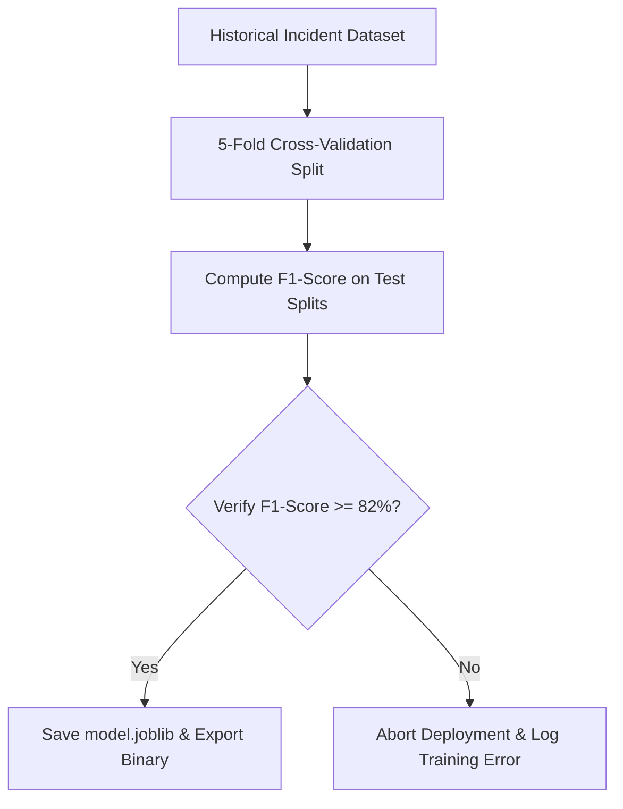

# System Validation & Testing Strategy

## Project: SafeRoute AI
### AI-Powered Road Accident Hotspot Prediction System

---

| Metric | Details |
| :--- | :--- |
| **Document Version** | 1.0.0 |
| **Status** | Approved |
| **Author** | SafeRoute AI Lead QA & Verification Engineer |
| **Date** | 2026-07-27 |
| **Intended Audience** | Developers, QA Engineers, DevOps Engineers, ML Engineers |

---

## Table of Contents
1. [Testing Vision & Objectives](#1-testing-vision--objectives)
2. [Unit Testing Specifications](#2-unit-testing-specifications)
3. [Integration Testing Specifications](#3-integration-testing-specifications)
4. [Machine Learning Model Validation](#4-machine-learning-model-validation)
5. [End-to-End (E2E) Browser Testing](#5-end-to-end-e2e-browser-testing)
6. [Test Automation in CI/CD](#6-test-automation-in-cicd)
7. [Defect Life Cycle & Management](#7-defect-life-cycle--management)
8. [Assumptions, Risks & Mitigation](#8-assumptions-risks--mitigation)
9. [Best Practices](#9-best-practices)
10. [Revision History](#10-revision-history)
11. [References](#11-references)

---

## 1. Testing Vision & Objectives
This testing strategy document establishes the validation framework for SafeRoute AI. Our primary objectives are:
* **Maintain Code Quality**: Ensure a minimum code coverage threshold of 85% for backend API paths.
* **Verify ML Performance**: Validate that model classification performance meets defined F1-score thresholds.
* **Cross-Browser Consistency**: Verify that interactive maps and charts load cleanly across multiple browsers.

---

## 2. Unit Testing Specifications

### 2.1 Backend (Python & Pytest)
* **Framework**: `pytest` with `pytest-cov` and `pytest-mock`.
* **Strategy**: Mock external dependencies (such as PostgreSQL database connections and Scikit-Learn model files) to isolate the unit logic of FastAPI endpoint routers.

```python
# Example: Testing auth registration validation logic
def test_user_registration_weak_password(client, mocker):
    payload = {
        "email": "test@example.com",
        "password": "123", # Too short
        "full_name": "Test User"
    }
    response = client.post("/api/auth/register", json=payload)
    assert response.status_code == 400
    assert "detail" in response.json()
```

### 2.2 Frontend (React Testing Library & Jest)
* **Framework**: React Testing Library and Vitest/Jest.
* **Strategy**: Verify component rendering, state changes, and Axios API error displays in mock environments.

---

## 3. Integration Testing Specifications
* **Database Isolations**: Run integration tests using separate PostgreSQL container databases, applying Alembic migrations to setup clean states.
* **Route Integrations**: Use FastAPI's `TestClient` class to execute client requests against endpoints, verifying authentication middleware logic and database transactions.
* **API Command**:
  ```bash
  cd backend
  pytest tests/integration/
  ```

---

## 4. Machine Learning Model Validation

To ensure predictions remain consistent, the machine learning pipeline enforces validation checks before model binaries are deployed:



### 4.1 Evaluation Metrics
The training script outputs verification summaries to the console, tracking:
* **F1-Score**: The primary performance metric, balancing precision and recall.
* **Precision**: Verifies the rate of true positive hotspot predictions against false positives.
* **Recall**: Evaluates the model's ability to identify historical accident locations correctly.

---

## 5. End-to-End (E2E) Browser Testing
* **Tools**: Playwright or Cypress.
* **Scope**: Automate testing of complete user journeys, including user registration, login, dashboard map interactions, prediction submissions, and database query updates.
* **Command**:
  ```bash
  cd frontend
  npx playwright test
  ```

---

## 6. Test Automation in CI/CD
Tests run automatically on every pull request submitted to the repository via GitHub Actions:
1. Initialize the Python virtual environment and node environments.
2. Run database migration scripts inside test databases.
3. Run backend lint checks and Pytest suites.
4. Build static frontend assets and verify ESLint rules.
5. Prevent merges if tests or build steps fail.

---

## 7. Defect Life Cycle & Management
* **Tracking**: Log all identified bugs as issues in the project repository, attaching steps to reproduce, screenshots, and logs.
* **Resolution**: Assign bugs to developers for correction, requiring passing unit and integration tests before resolving the issues.

---

## 8. Assumptions, Risks & Mitigation

### 8.1 Assumptions
* Test suites run in isolated environments without modifying production database records.

### 8.2 Testing Risks & Mitigation
* **Risk**: Flaky tests in the CI/CD pipeline due to varying network latency when fetching external resources like the Google Maps API.
  * *Mitigation*: Mock external API calls and use static datasets for map coordinate tests.

---

## 9. Best Practices
* **Enforce Clean Code**: Clean up test databases between test runs to ensure tests execute independently.
* **Mock External APIs**: Under no circumstances execute real calls to paid APIs during automated test runs.

## 10. Revision History

| Version | Date | Author | Description |
| :--- | :--- | :--- | :--- |
| **1.0.0** | 2026-07-27 | QA Lead | Initial testing strategy document covering unit, integration, and ML validation. |

---

## 11. References
1. *Pytest Documentation*: https://docs.pytest.org/en/stable/
2. *React Testing Library Guides*: https://testing-library.com/docs/react-testing-library/intro/
3. *Playwright End-to-End Testing Documentation*: https://playwright.dev/docs/intro
