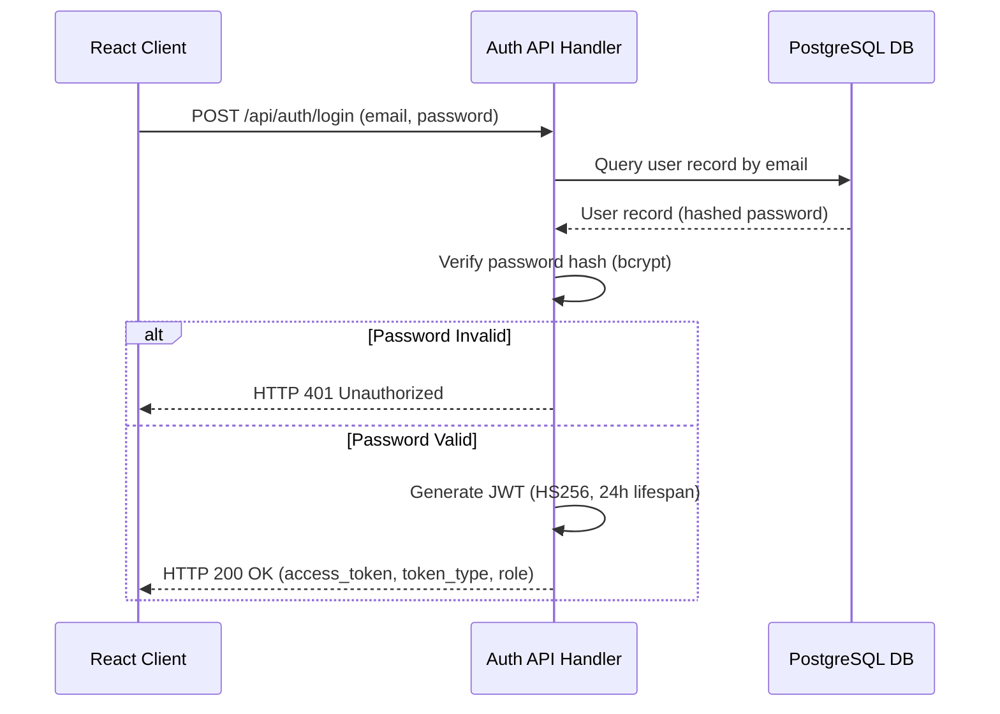

# Technical Requirements Document (TRD)

## Project: SafeRoute AI
### AI-Powered Road Accident Hotspot Prediction System

---

| Metric | Details |
| :--- | :--- |
| **Document Version** | 1.0.0 |
| **Status** | Approved |
| **Author** | SafeRoute AI Technical Architecture Team |
| **Date** | 2026-07-27 |
| **Intended Audience** | Lead Engineers, Backend Developers, Frontend Developers, ML Engineers, DevOps Engineers |

---

## Table of Contents
1. [Introduction & Purpose](#1-introduction--purpose)
2. [Technology Stack & Version Constraints](#2-technology-stack--version-constraints)
3. [Performance Targets (SLAs)](#3-performance-targets-slas)
4. [Security Standards](#4-security-standards)
5. [Authentication & Authorization Model](#5-authentication--authorization-model)
6. [Machine Learning Specifications](#6-machine-learning-specifications)
7. [Error Handling & Logging Standards](#7-error-handling--logging-standards)
8. [Testing Strategy](#8-testing-strategy)
9. [Scalability Targets & Design Patterns](#9-scalability-targets--design-patterns)
10. [Deployment & Infrastructure Constraints](#10-deployment--infrastructure-constraints)
11. [Assumptions, Risks & Mitigation](#11-assumptions-risks--mitigation)
12. [Best Practices](#12-best-practices)
13. [Future Enhancements](#13-future-enhancements)
14. [Revision History](#14-revision-history)
15. [References](#15-references)

---

## 1. Introduction & Purpose
This Technical Requirements Document (TRD) specifies the hardware, software, coding, security, and performance requirements for SafeRoute AI. This document serves as the guide for the technical execution of the project, ensuring standard-compliant development, reproducible machine learning modeling, and secure database interactions.

---

## 2. Technology Stack & Version Constraints

To guarantee environment reproducibility, all software versions are pinned.

### 2.1 Backend Stack (FastAPI)
* **Runtime**: Python `3.11.x`
* **Web Framework**: FastAPI `^0.110.0`
* **ASGI Server**: Uvicorn `^0.28.0`
* **ORM**: SQLAlchemy `^2.0.28` (with Asyncpg driver)
* **Validation**: Pydantic v2 (`^2.6.4`)

### 2.2 Frontend Stack (React)
* **Framework**: React `18.2.0` (Vite client generator)
* **CSS Framework**: Tailwind CSS `^3.4.1` (with CSS Variables customization)
* **Animations**: Framer Motion `^11.0.0`
* **Icons Library**: Lucide React `^0.344.0` (for outline style icons)
* **Toasts**: Sonner `^1.4.0` (minimal status toast notifications)
* **HTTP Client**: Axios `^1.6.8`
* **Routing**: React Router DOM `^6.22.3`
* **Charting**: Chart.js `^4.4.2` + `react-chartjs-2`
* **Maps API**: Google Maps JavaScript API (via `@googlemaps/js-api-loader`)

### 2.3 Machine Learning Pipeline
* **Library**: Scikit-Learn `^1.4.1` (Random Forest Classifier)
* **Data Handling**: Pandas `^2.2.1`, NumPy `^1.26.4`
* **Model Serialization**: Joblib `^1.3.2`

### 2.4 Database & Infrastructure
* **Relational DB**: PostgreSQL `16.x`
* **Containerization**: Docker `^25.0.0` (Docker Compose version `2.x`)
* **Reverse Proxy**: Nginx `1.25.x`

---

## 3. Performance Targets (SLAs)

| Operational metric | Threshold | Measurement Method |
| :--- | :--- | :--- |
| **Prediction Inference Latency** | <= 100ms | Server-side execution duration trace (FastAPI middleware). |
| **API Endpoints (Read)** | <= 200ms (P95) | Load testing using Locust simulating 50 concurrent users. |
| **API Endpoints (Write)** | <= 300ms (P95) | DB query tracing, indexing audits. |
| **UI First Contentful Paint (FCP)** | <= 1.2s | Google Lighthouse Audit (Desktop emulation). |
| **UI Time to Interactive (TTI)** | <= 2.2s | Google Lighthouse Audit. |
| **Docker Build Time** | <= 8 min | CI/CD Runner build pipeline timestamps. |

---

## 4. Security Standards

### 4.1 Transport Encryption
* TLS 1.3 is enforced.
* Automatic HTTP redirection to HTTPS via Nginx configuration.
* HTTP Strict Transport Security (HSTS) enabled with `max-age=31536000; includeSubDomains`.

### 4.2 API Security Controls
* **CORS**: Setup explicit origins pointing strictly to Vite frontend production URL. Disallow `*` wildcard in production settings.
* **Headers**: Inject secure headers on all responses:
  * `X-Frame-Options: DENY`
  * `X-Content-Type-Options: nosniff`
  * `Content-Security-Policy` restrict script sources to trusted domains and Google Maps script.
* **Input Validation**: All FastAPI inputs validated through typed Pydantic models. Any invalid input types yield standard `422 Unprocessable Entity` responses without leakage of internal stack traces.

---

## 5. Authentication & Authorization Model

### 5.1 Authentication Flow
1. User requests auth with email and password via `POST /api/auth/login`.
2. Password checked via `bcrypt.verify()`.
3. If valid, server generates a signed JSON Web Token (JWT).
   * **Signing Algorithm**: HMAC-SHA256 (`HS256`).
   * **Payload Claim Elements**: Sub (User ID), Email, Role, Exp (Expiration time set to 24 hours).
4. The JWT is returned in the JSON response payload.
5. The React client intercepts this token and stores it in secure state / session storage. All subsequent requests attach the token to the `Authorization` header as a `Bearer <token>` element.



### 5.2 Authorization Model (Role-Based Access Control)
The application enforces two access levels:
* **Standard User (`user`)**: Can view dashboard, manage profile, issue map predictions, and view personal history.
* **System Administrator (`admin`)**: Inherits all standard permissions, plus accesses CSV dataset uploads, reads global system prediction logs, view user lists, and monitors statistics.

---

## 6. Machine Learning Specifications

### 6.1 Model Architecture
* **Algorithm**: Random Forest Classifier (`sklearn.ensemble.RandomForestClassifier`).
* **Hyperparameters**: `n_estimators=100`, `max_depth=12`, `random_state=42`.

### 6.2 Input Features Matrix

| Feature | Data Type | Encoding | Example Values |
| :--- | :--- | :--- | :--- |
| **Weather** | Categorical | One-Hot Encoded | `Clear`, `Rainy`, `Snowy`, `Foggy`, `Windy` |
| **Traffic Density** | Categorical | Ordinal Encoded | `0 (Low)`, `1 (Medium)`, `2 (High)`, `3 (Jammed)` |
| **Road Type** | Categorical | One-Hot Encoded | `Highway`, `Arterial`, `Local`, `Expressway` |
| **Average Speed** | Numerical | Standard Scaled | `30.0` - `120.0` (km/h) |
| **Time of Day** | Categorical | One-Hot Encoded | `Morning`, `Afternoon`, `Evening`, `Night` |

### 6.3 Target Label
* **Accident Risk Classification**: Binary label `1` (Accident occurred under these parameters) or `0` (Safe/No Accident).

### 6.4 Output Schema
* **Prediction Score**: Numerical value `0.0` to `1.0` representing model class probability for label `1`.
* **Risk Score**: Calculated as `Probability * 100` (Int value `0` to `100`).
* **Risk Category**:
  * `Low` (Risk Score: `0` to `25`)
  * `Medium` (Risk Score: `26` to `50`)
  * `High` (Risk Score: `51` to `75`)
  * `Critical` (Risk Score: `76` to `100`)

---

## 7. Error Handling & Logging Standards

### 7.1 FastAPI Error Handling
* Override default exception handlers to standardise structure.
* All JSON error responses must conform to:
  ```json
  {
    "detail": {
      "error_code": "RESOURCE_NOT_FOUND",
      "message": "The requested prediction record was not found.",
      "timestamp": "2026-07-27T03:57:00Z"
    }
  }
  ```
* Standard HTTP error codes maps as follows:
  * `400 Bad Request`: Input payload validation failure.
  * `401 Unauthorized`: Missing or expired JWT token.
  * `403 Forbidden`: Insufficient user roles (e.g., standard user accessing admin data).
  * `404 Not Found`: Entity not found in DB.
  * `500 Internal Error`: DB disconnect, model file missing, or uncaught exception.

### 7.2 Logging Standards
* Logging implemented using Python's standard `logging` library configured via a structured dict.
* Output logs configured in standard JSON format in production.
* Minimum logging levels: `INFO` in production, `DEBUG` in development.
* Log rotation configured at Nginx level and docker daemon levels (Max size `10MB`, max logs `5`).

---

## 8. Testing Strategy
* **Unit Testing**: Python unit tests written using pytest (`pytest-cov` for coverage). Minimum target coverage for API endpoints and model loading utility modules is 85%.
* **Integration Testing**: Testing backend routes against an active PostgreSQL container using `TestClient` in FastAPI.
* **Frontend Component Verification**: React components checked using React Testing Library and Jest (focusing on dashboard chart rendering and API error handling state banners).

---

## 9. Scalability Targets & Design Patterns
* **Stateless Backend Design**: The FastAPI server maintains absolutely no local session state. Scalability is achieved by scaling backend containers horizontally behind Nginx load balancers.
* **Database Connection Pooling**: SQLAlchemy configured with `pool_size=20`, `max_overflow=10`, and `pool_recycle=1800` to optimize PostgreSQL connections.
* **Indexes**: PostgreSQL indexes on `user_id` and query logs timestamp features to facilitate high-speed analytical reports.

---

## 10. Deployment & Infrastructure Constraints
* **Docker Port Bindings**:
  * Backend API: internally `8000`, mapped dynamically.
  * React client: built static resources served via Nginx on port `80` (mapped to `443` with SSL certifications).
* **Environment Configuration**: Absolute requirement that configuration options, including database passwords and private JWT keys, are managed via standard OS environment variables (or `.env` file for local deployment).
* **Storage Limits**: SQLite should not be used as an fallback storage in production. PostgreSQL DB storage is strictly isolated to container volumes or cloud RDS databases.

---

## 11. Assumptions, Risks & Mitigation

### 11.1 Assumptions
* The deployment target (Vercel, Render, Railway) supports running standard Python and React build scripts.
* Google Maps API calls are not throttled due to proper subscription configurations.

### 11.2 Risks & Mitigation
* **Risk**: ML Model file (`model.joblib`) size exceeding Vercel serverless size limits.
  * *Mitigation*: Ensure standard scaling pipelines and Random Forest models use maximum tree-depth controls (`max_depth=12`) to keep serialized model storage under `15MB`.

---

## 12. Best Practices
* **No Hardcoding**: Credentials, APIs, or model files should never be committed to git.
* **Linting Rules**: Enforce standard flake8 and Black code formatting checks before git merges.
* **Stateless Architecture**: Always pass database sessions contextually through FastAPI Dependency Injection patterns (`Depends`).

## 13. Future Enhancements
* Transition Random Forest prediction models to dynamic neural networks (using PyTorch) when daily incident training sets grow to millions of records.
* Cache frequent bounding-box risk score profiles in Redis to bypass database query latency entirely.

## 14. Revision History

| Version | Date | Author | Description |
| :--- | :--- | :--- | :--- |
| **1.0.0** | 2026-07-27 | Technical Architecture Team | Initial core architecture & technical specification release. |

---

## 15. References
1. *Bcrypt Hashing Standards*: https://github.com/pyca/bcrypt/
2. *SQLAlchemy 2.0 Async Documentation*: https://docs.sqlalchemy.org/en/20/orm/extensions/asyncio.html
3. *Vite Development Tooling Guide*: https://vite.dev/guide/
